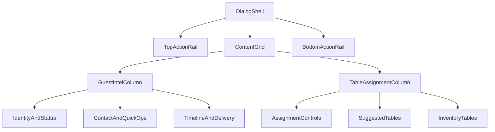

# Booking Dialog Command-Center Redesign Plan

## Goals

- Rebuild the booking details dialog as a dense, operations-first command center optimized for fast scanning and actions.
- Keep all existing lifecycle logic, query hooks, and action handlers intact; redesign presentation and information architecture only.
- Enforce responsive behavior across mobile sheet, tablet modal, and desktop modal without horizontal overflow.

## Target Files

- Orchestrator/shell:
  - [/Users/amankumarshrestha/LapenInns Project/nabatableLP/src/components/features/dashboard/booking-details/BookingDialog.tsx](/Users/amankumarshrestha/LapenInns%20Project/nabatableLP/src/components/features/dashboard/booking-details/BookingDialog.tsx)
  - [/Users/amankumarshrestha/LapenInns Project/nabatableLP/src/components/features/dashboard/booking-details/components/BookingDialogBody.tsx](/Users/amankumarshrestha/LapenInns%20Project/nabatableLP/src/components/features/dashboard/booking-details/components/BookingDialogBody.tsx)
  - [/Users/amankumarshrestha/LapenInns Project/nabatableLP/src/components/features/dashboard/booking-details/components/DialogHeader.tsx](/Users/amankumarshrestha/LapenInns%20Project/nabatableLP/src/components/features/dashboard/booking-details/components/DialogHeader.tsx)
- Guest intelligence panels:
  - [/Users/amankumarshrestha/LapenInns Project/nabatableLP/src/components/features/dashboard/booking-details/components/GuestProfilePanel.tsx](/Users/amankumarshrestha/LapenInns%20Project/nabatableLP/src/components/features/dashboard/booking-details/components/GuestProfilePanel.tsx)
  - [/Users/amankumarshrestha/LapenInns Project/nabatableLP/src/components/features/dashboard/booking-details/components/guest/GuestIdentityCard.tsx](/Users/amankumarshrestha/LapenInns%20Project/nabatableLP/src/components/features/dashboard/booking-details/components/guest/GuestIdentityCard.tsx)
  - [/Users/amankumarshrestha/LapenInns Project/nabatableLP/src/components/features/dashboard/booking-details/components/guest/GuestContactCard.tsx](/Users/amankumarshrestha/LapenInns%20Project/nabatableLP/src/components/features/dashboard/booking-details/components/guest/GuestContactCard.tsx)
  - [/Users/amankumarshrestha/LapenInns Project/nabatableLP/src/components/features/dashboard/booking-details/components/guest/GuestMetaGrid.tsx](/Users/amankumarshrestha/LapenInns%20Project/nabatableLP/src/components/features/dashboard/booking-details/components/guest/GuestMetaGrid.tsx)
  - [/Users/amankumarshrestha/LapenInns Project/nabatableLP/src/components/features/dashboard/booking-details/components/guest/GuestTimelineCard.tsx](/Users/amankumarshrestha/LapenInns%20Project/nabatableLP/src/components/features/dashboard/booking-details/components/guest/GuestTimelineCard.tsx)
  - [/Users/amankumarshrestha/LapenInns Project/nabatableLP/src/components/features/dashboard/booking-details/components/guest/GuestNotesCard.tsx](/Users/amankumarshrestha/LapenInns%20Project/nabatableLP/src/components/features/dashboard/booking-details/components/guest/GuestNotesCard.tsx)
  - [/Users/amankumarshrestha/LapenInns Project/nabatableLP/src/components/features/dashboard/booking-details/components/guest/GuestSeatingCard.tsx](/Users/amankumarshrestha/LapenInns%20Project/nabatableLP/src/components/features/dashboard/booking-details/components/guest/GuestSeatingCard.tsx)
  - [/Users/amankumarshrestha/LapenInns Project/nabatableLP/src/components/features/dashboard/booking-details/components/guest/GuestDepositCard.tsx](/Users/amankumarshrestha/LapenInns%20Project/nabatableLP/src/components/features/dashboard/booking-details/components/guest/GuestDepositCard.tsx)
- Delivery observability:
  - [/Users/amankumarshrestha/LapenInns Project/nabatableLP/src/components/features/dashboard/booking-details/components/EmailDeliveryPanel.tsx](/Users/amankumarshrestha/LapenInns%20Project/nabatableLP/src/components/features/dashboard/booking-details/components/EmailDeliveryPanel.tsx)
  - [/Users/amankumarshrestha/LapenInns Project/nabatableLP/src/components/features/dashboard/booking-details/components/SmsDeliveryPanel.tsx](/Users/amankumarshrestha/LapenInns%20Project/nabatableLP/src/components/features/dashboard/booking-details/components/SmsDeliveryPanel.tsx)
- Table assignment command surface:
  - [/Users/amankumarshrestha/LapenInns Project/nabatableLP/src/components/features/dashboard/booking-details/components/TableAssignmentPanel.tsx](/Users/amankumarshrestha/LapenInns%20Project/nabatableLP/src/components/features/dashboard/booking-details/components/TableAssignmentPanel.tsx)
  - [/Users/amankumarshrestha/LapenInns Project/nabatableLP/src/components/features/dashboard/booking-details/components/table-assignment/TableAssignmentSummaryCard.tsx](/Users/amankumarshrestha/LapenInns%20Project/nabatableLP/src/components/features/dashboard/booking-details/components/table-assignment/TableAssignmentSummaryCard.tsx)
  - [/Users/amankumarshrestha/LapenInns Project/nabatableLP/src/components/features/dashboard/booking-details/components/table-assignment/TableAssignmentFilters.tsx](/Users/amankumarshrestha/LapenInns%20Project/nabatableLP/src/components/features/dashboard/booking-details/components/table-assignment/TableAssignmentFilters.tsx)
  - [/Users/amankumarshrestha/LapenInns Project/nabatableLP/src/components/features/dashboard/booking-details/components/table-assignment/TableAssignmentAlerts.tsx](/Users/amankumarshrestha/LapenInns%20Project/nabatableLP/src/components/features/dashboard/booking-details/components/table-assignment/TableAssignmentAlerts.tsx)
  - [/Users/amankumarshrestha/LapenInns Project/nabatableLP/src/components/features/dashboard/booking-details/components/table-assignment/SuggestedTablesSection.tsx](/Users/amankumarshrestha/LapenInns%20Project/nabatableLP/src/components/features/dashboard/booking-details/components/table-assignment/SuggestedTablesSection.tsx)
  - [/Users/amankumarshrestha/LapenInns Project/nabatableLP/src/components/features/dashboard/booking-details/components/table-assignment/AllTablesSection.tsx](/Users/amankumarshrestha/LapenInns%20Project/nabatableLP/src/components/features/dashboard/booking-details/components/table-assignment/AllTablesSection.tsx)
  - [/Users/amankumarshrestha/LapenInns Project/nabatableLP/src/components/features/dashboard/booking-details/components/table-assignment/VirtualizedAllTablesSection.tsx](/Users/amankumarshrestha/LapenInns%20Project/nabatableLP/src/components/features/dashboard/booking-details/components/table-assignment/VirtualizedAllTablesSection.tsx)
  - [/Users/amankumarshrestha/LapenInns Project/nabatableLP/src/components/features/dashboard/booking-details/components/table-assignment/TableCardGrid.tsx](/Users/amankumarshrestha/LapenInns%20Project/nabatableLP/src/components/features/dashboard/booking-details/components/table-assignment/TableCardGrid.tsx)
  - [/Users/amankumarshrestha/LapenInns Project/nabatableLP/src/components/features/dashboard/booking-details/components/SelectableTableCard.tsx](/Users/amankumarshrestha/LapenInns%20Project/nabatableLP/src/components/features/dashboard/booking-details/components/SelectableTableCard.tsx)

## Command-Center Information Architecture

## Implementation Steps

1. Rebuild shell layout in `BookingDialog` and `BookingDialogBody`

- Define a consistent command-center frame: top rail (status + critical metadata), two-column content workspace, bottom rail for primary/secondary actions.
- Use responsive breakpoints so mobile becomes a stacked operational flow and desktop uses dense split panels.
- Standardize panel heights, scroll containers, and sticky action rails to avoid nested overflow issues.

2. Redesign header and action rails for operational scanning

- Refactor `DialogHeader` into compact KPI chips: status, service time, covers, reference, urgency.
- Normalize action button hierarchy (primary lifecycle action, secondary contact, overflow menu) with predictable sizing and placement.
- Improve keyboard focus order and visible focus states for all primary controls.

3. Rebuild guest intelligence panels into compact operational cards

- Redesign `GuestProfilePanel` IA to reduce tab friction: prioritise identity/contact/status at top, history/delivery in secondary region.
- Update guest cards (`GuestIdentityCard`, `GuestContactCard`, `GuestMetaGrid`, `GuestTimelineCard`, `GuestNotesCard`, `GuestSeatingCard`, `GuestDepositCard`) to shared card anatomy and tokenized spacing.
- Ensure typography hierarchy is dense but legible in small viewport widths.

4. Rebuild table assignment as a dedicated command surface

- Make `TableAssignmentPanel` a strict two-zone workspace (control rail + table canvas).
- Redesign summary/filters/alerts components to behave as a coherent control stack.
- Redesign `SelectableTableCard` and table grid sections for high-contrast state semantics (available, selected, assigned, conflict, unavailable) with consistent badges/timeline cues.
- Keep virtualized and non-virtualized inventory sections visually identical.

5. Redesign delivery observability sections

- Restyle `EmailDeliveryPanel` and `SmsDeliveryPanel` into dense event logs with clear group headers, statuses, and errors.
- Preserve current grouping/event logic while improving read order and responsiveness.

6. Validate and harden responsiveness + accessibility

- Verify at mobile (`<640`), tablet (`640-1023`), desktop (`1024+`), and wide (`1280+`) layouts.
- Run lints for all touched files and resolve regressions.
- Verify dialog keyboard navigation, focus traps, and critical action discoverability.

## Design System + Frontend Principles Applied

- Use existing shadcn primitives and current token palette (`bg-card`, `border-border`, `text-muted-foreground`, `primary`, `destructive`) only.
- Prefer compositional layout refactors over ad-hoc per-component class patches.
- Ensure component responsibilities stay isolated (shell orchestration vs panel presentation vs card rendering).
- Keep interaction logic unchanged to reduce behavioral risk.
