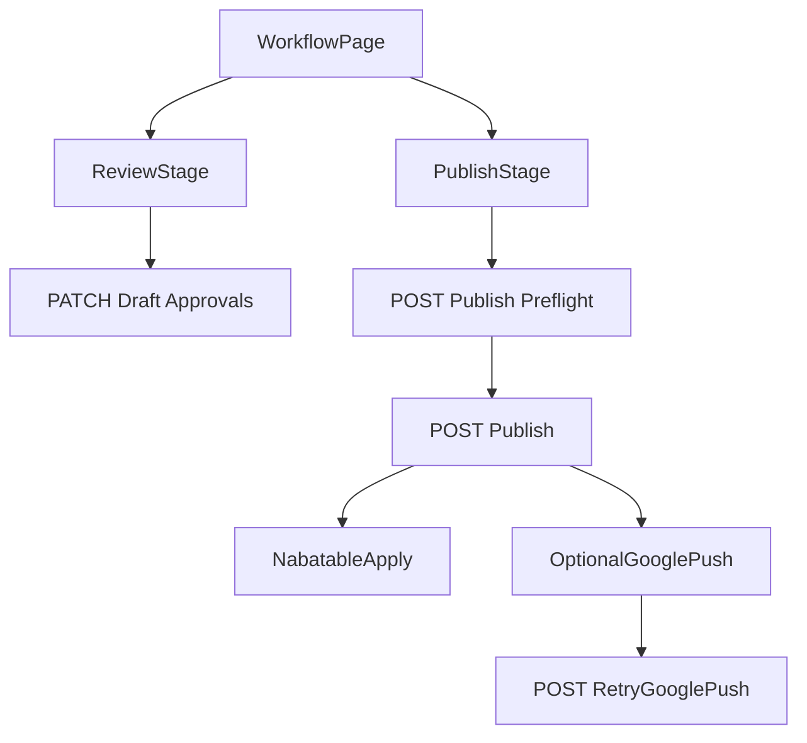

# GBP Approval Workflow Re-architecture Plan

## Goals

- Replace the current confusing mixed interaction model with a strict staged model:
  - Stage 1: Review + Approve selection
  - Stage 2: Publish approved set
- Align terminology, state transitions, and backend contracts to the completed directionality intent.
- Ship a clearer, task-led UI with explicit progress and failure recovery.

## Target Architecture

## UX/IA Rebuild (Frontend)

- Rebuild the primary workflow surface in [`/Users/amankumarshrestha/LapenInns Project/nabatableLP/src/components/features/restaurant-settings/google-business-profile/components/WorkflowCard.tsx`](/Users/amankumarshrestha/LapenInns%20Project/nabatableLP/src/components/features/restaurant-settings/google-business-profile/components/WorkflowCard.tsx) into a **stepper layout** with two explicit panels:
  - `Step 1: Review & Approve` (editable selection list lives here, not hidden in publish dialog)
  - `Step 2: Publish Approved Changes` (disabled until Step 1 approved)
- Refactor [`/Users/amankumarshrestha/LapenInns Project/nabatableLP/src/components/features/restaurant-settings/google-business-profile/GoogleBusinessProfileSyncActionDialog.tsx`](/Users/amankumarshrestha/LapenInns%20Project/nabatableLP/src/components/features/restaurant-settings/google-business-profile/GoogleBusinessProfileSyncActionDialog.tsx):
  - Remove mixed “selection + preflight + password” confusion.
  - Dialog should become **publish-confirmation only** (direction choice, preflight result, password, confirm).
- Reorder section composition in [`/Users/amankumarshrestha/LapenInns Project/nabatableLP/src/components/features/restaurant-settings/google-business-profile/GoogleBusinessProfileSection.tsx`](/Users/amankumarshrestha/LapenInns%20Project/nabatableLP/src/components/features/restaurant-settings/google-business-profile/GoogleBusinessProfileSection.tsx):
  - Prioritize “what to do next” workflow panel above secondary analysis cards.
  - Move alignment/snapshot into clearly secondary areas.
- Normalize user-facing language across [`/Users/amankumarshrestha/LapenInns Project/nabatableLP/src/components/features/restaurant-settings/google-business-profile/components/StatusBadge.tsx`](/Users/amankumarshrestha/LapenInns%20Project/nabatableLP/src/components/features/restaurant-settings/google-business-profile/components/StatusBadge.tsx) and workflow copy:
  - Primary path: `Google -> Nabatable`
  - Secondary path: `Optional Nabatable -> Google`
  - No backend-shaped error text in first-line UI copy.

## Workflow State Machine + Contract (Backend)

- Rework approval/publish guards in [`/Users/amankumarshrestha/LapenInns Project/nabatableLP/server/google-business-profile/workflow.ts`](/Users/amankumarshrestha/LapenInns%20Project/nabatableLP/server/google-business-profile/workflow.ts):
  - Enforce strict publish precondition: publish only when draft is `approved` (not `review_ready`/`failed` direct publish).
  - Make stale or mismatched selection failures return UX-safe typed errors for Step 1 guidance.
- Tighten route behavior in:
  - [`/Users/amankumarshrestha/LapenInns Project/nabatableLP/src/app/api/ops/restaurants/[id]/google-business-profile/drafts/[draftId]/route.ts`](/Users/amankumarshrestha/LapenInns%20Project/nabatableLP/src/app/api/ops/restaurants/%5Bid%5D/google-business-profile/drafts/%5BdraftId%5D/route.ts)
  - [`/Users/amankumarshrestha/LapenInns Project/nabatableLP/src/app/api/ops/restaurants/[id]/google-business-profile/drafts/[draftId]/publish/preflight/route.ts`](/Users/amankumarshrestha/LapenInns%20Project/nabatableLP/src/app/api/ops/restaurants/%5Bid%5D/google-business-profile/drafts/%5BdraftId%5D/publish/preflight/route.ts)
  - [`/Users/amankumarshrestha/LapenInns Project/nabatableLP/src/app/api/ops/restaurants/[id]/google-business-profile/drafts/[draftId]/publish/route.ts`](/Users/amankumarshrestha/LapenInns%20Project/nabatableLP/src/app/api/ops/restaurants/%5Bid%5D/google-business-profile/drafts/%5BdraftId%5D/publish/route.ts)
- Ensure retry semantics remain consistent with directionality sprint:
  - Nabatable leg is primary completion criterion.
  - Google retry remains post-partial-failure recovery path only.

## Client Data + Service Layer

- Update types and API helpers in:
  - [`/Users/amankumarshrestha/LapenInns Project/nabatableLP/src/services/ops/restaurants.ts`](/Users/amankumarshrestha/LapenInns%20Project/nabatableLP/src/services/ops/restaurants.ts)
  - [`/Users/amankumarshrestha/LapenInns Project/nabatableLP/src/hooks/ops/useOpsGoogleBusinessProfile.ts`](/Users/amankumarshrestha/LapenInns%20Project/nabatableLP/src/hooks/ops/useOpsGoogleBusinessProfile.ts)
- Add explicit front-end state model for staged progression (`review`, `approved`, `preflighted`, `publishing`, `published`, `partial_failure`).

## Testing and Verification

- Update/expand component tests:
  - [`/Users/amankumarshrestha/LapenInns Project/nabatableLP/tests/components/GoogleBusinessProfileSection.test.tsx`](/Users/amankumarshrestha/LapenInns%20Project/nabatableLP/tests/components/GoogleBusinessProfileSection.test.tsx)
  - [`/Users/amankumarshrestha/LapenInns Project/nabatableLP/tests/components/GoogleBusinessProfileSyncActionDialog.test.tsx`](/Users/amankumarshrestha/LapenInns%20Project/nabatableLP/tests/components/GoogleBusinessProfileSyncActionDialog.test.tsx)
- Add/update server-route and workflow tests:
  - [`/Users/amankumarshrestha/LapenInns Project/nabatableLP/tests/server/google-business-profile-workflow-routes.test.ts`](/Users/amankumarshrestha/LapenInns%20Project/nabatableLP/tests/server/google-business-profile-workflow-routes.test.ts)
  - [`/Users/amankumarshrestha/LapenInns Project/nabatableLP/tests/server/google-business-profile-workflow.test.ts`](/Users/amankumarshrestha/LapenInns%20Project/nabatableLP/tests/server/google-business-profile-workflow.test.ts)
- Verify with repo-standard checks:
  - `pnpm run lint`
  - `pnpm run typecheck`
  - targeted `pnpm exec vitest ...` for touched suites
  - browser verification on shipped ops route (`/app/settings/restaurant/google-business-profile`)

## Delivery Notes

- Keep shadcn-first composition and existing ops theme primitives.
- Keep database schema intact unless strict-step transitions require additive migration (to be decided during implementation with backward compatibility preserved).
- Preserve directionality telemetry/audit semantics (publish jobs/events) as the source of operational truth.
