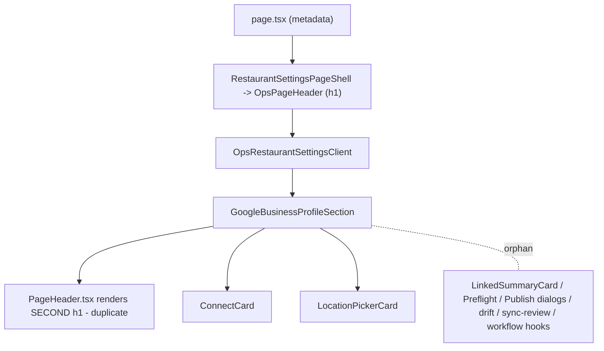
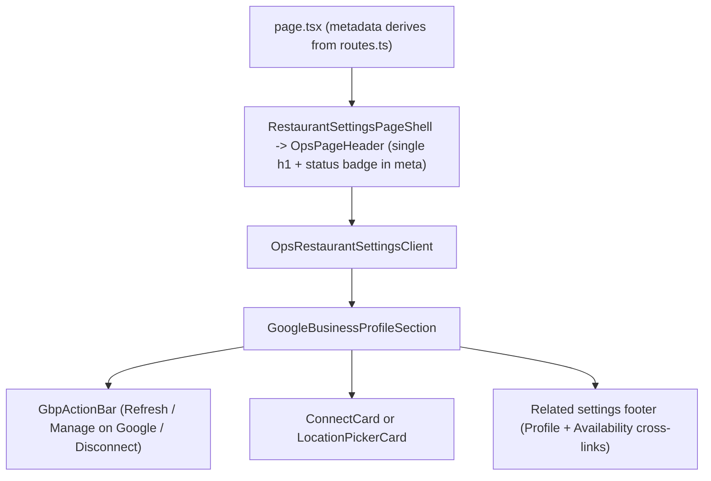

# GBP settings IA audit + cleanup

Treat this plan as both Stage A (FINDINGS) and Stage B (sequenced fixes). The audit folder is `tasks/google-business-profile-ia-audit-20260502-1201/` and `FINDINGS.md` materialises the table below verbatim.

## Locked design calls

- (a) Layout: keep the current 2-card stack (`ConnectCard` OR `LocationPickerCard`) but drop the section's own header and let the existing `OpsPageHeader` from `RestaurantSettingsPageShell` own the h1, subtitle, and status meta. No accordion, no tabs.
- (b) Duplicated affordance: keep one Connect/Reconnect/Refresh/Disconnect cluster on the section, exposed as a compact action bar above the active card. Drop the dropdown "More actions" duplication (the `Manage on Google` and `Disconnect` items collapse into the same compact bar). Keep `connectionStatusBadge` rendered next to the `OpsPageHeader` title via the existing `meta` slot.
- (c) Dead UI: delete the entire orphaned approval-workflow scaffold (component files, libs, hooks, server routes, and tests) since nothing in `src/` imports it. Keep `googleBusinessProfileVerification.deriveProfileVerification` (still used by `RestaurantProfileSection.tsx` and `RestaurantDetailsForm.tsx`) and `GoogleBusinessProfileComparisonBadge` (used by `RestaurantDetailsForm.tsx`).

## Architecture today vs after

## Stage A - FINDINGS.md

Severity: **B** = blocker, **U** = UX, **N** = noise.

### F-table (per-route findings)

- **F-01 (B)** Duplicate h1 "Google Business Profile". Shell already renders one in [src/components/features/restaurant-settings/RestaurantSettingsPageShell.tsx](src/components/features/restaurant-settings/RestaurantSettingsPageShell.tsx) lines 63-80; section renders a second in [src/components/features/restaurant-settings/google-business-profile/components/PageHeader.tsx](src/components/features/restaurant-settings/google-business-profile/components/PageHeader.tsx) line 50. Violates AGENTS.md ("section MUST NOT render a competing CardTitle of the same name"). _Stale copy + duplicate title._
- **F-02 (B)** Dead UI affordance promised in route metadata. [src/components/features/restaurant-settings/routes.ts](src/components/features/restaurant-settings/routes.ts) line 23 says "...and review profile changes." but no review/approval workflow renders in [src/components/features/restaurant-settings/google-business-profile/GoogleBusinessProfileSection.tsx](src/components/features/restaurant-settings/google-business-profile/GoogleBusinessProfileSection.tsx). _Dead UI affordance._
- **F-03 (B)** Three competing copy sources. routes.ts: "Connect Google, link a location, and review profile changes." vs page metadata in [src/app/app/(app)/settings/restaurant/google-business-profile/page.tsx](<src/app/app/(app)/settings/restaurant/google-business-profile/page.tsx>) line 7: "Connect a Google account and link the correct GBP location to this restaurant." vs section sub-meta strip "Last checked / Provider timezone". _Stale copy._
- **F-04 (B)** Empty/loading/error variants drop chrome. [GoogleBusinessProfileSection.tsx](src/components/features/restaurant-settings/google-business-profile/GoogleBusinessProfileSection.tsx) lines 33-43 (LoadingSkeleton), 110-119 (no-restaurant), 125-145 (error), 148-150 (return null on missing data). None of those render the action bar or related-settings footer; the page chrome shrinks/grows on restaurant switch. _Inconsistent shell framing._
- **F-05 (B)** `return null` on `!data` (line 149). Produces a blank page if the connection query resolves with no body. _Empty state hole._
- **F-06 (U)** Two redundant action surfaces inside `PageHeader.tsx`: visible "Refresh Google" button + dropdown menu with "Manage on Google" and "Disconnect Google". Same status, two locations. _Duplicate affordance._
- **F-07 (U)** No anchor IDs and no hash listener. Cross-link from Profile page ("Review Google changes" in [RestaurantProfileSection.tsx](src/components/features/restaurant-settings/RestaurantProfileSection.tsx) line 92-94) lands users at the top of an undifferentiated card stack. _Missing deeplink targets._
- **F-08 (U)** No "Related settings" footer. The route mentions "review profile changes" but there is no link back to Profile or to Availability where availability/hours drift would actually be edited. _Missing cross-route nav._
- **F-09 (N)** Orphan UI components (zero callers in `src/`):
  - [components/LinkedSummaryCard.tsx](src/components/features/restaurant-settings/google-business-profile/components/LinkedSummaryCard.tsx)
  - [components/PreflightReviewDialog.tsx](src/components/features/restaurant-settings/google-business-profile/components/PreflightReviewDialog.tsx)
  - [components/PublishPasswordDialog.tsx](src/components/features/restaurant-settings/google-business-profile/components/PublishPasswordDialog.tsx)
  - [components/alignmentModel.ts](src/components/features/restaurant-settings/google-business-profile/components/alignmentModel.ts)
  - [components/snapshotModel.ts](src/components/features/restaurant-settings/google-business-profile/components/snapshotModel.ts)
  - [lib/drift.ts](src/components/features/restaurant-settings/google-business-profile/lib/drift.ts)
  - [lib/sync-review.ts](src/components/features/restaurant-settings/google-business-profile/lib/sync-review.ts) _Dead code._
- **F-10 (N)** Orphan hook exports in [src/hooks/ops/useOpsGoogleBusinessProfile.ts](src/hooks/ops/useOpsGoogleBusinessProfile.ts): `useOpsGoogleBusinessProfileWorkflowStage`, `useOpsGoogleBusinessProfileWorkflow`, `useOpsCreateGoogleBusinessProfileDraft`, `useOpsUpdateGoogleBusinessProfileDraft`, `useOpsPublishGoogleBusinessProfileDraft`, `useOpsPreflightGoogleBusinessProfileDraftPublish`, `useOpsRetryGoogleBusinessProfileDraftGooglePush`, `useOpsSyncGoogleBusinessProfile`. _Dead code._
- **F-11 (N)** Orphan API route handlers under `src/app/api/ops/restaurants/[id]/google-business-profile/drafts/**` and `.../workflow/**` — no client caller after F-10. _Dead code (server side; flag only, leave deletion for a follow-up if test fixtures still cover them)._
- **F-12 (N)** Orphan exports in [googleBusinessProfileVerification.ts](src/components/features/restaurant-settings/google-business-profile/googleBusinessProfileVerification.ts): `deriveOperatingHoursVerification`, `deriveServicePeriodsVerification`, `deriveOperatingHoursRowComparisons`, `deriveServicePeriodDayComparisons` (only [tests/components/googleBusinessProfileVerification.test.ts](tests/components/googleBusinessProfileVerification.test.ts) imports them). _Dead code._
- **F-13 (N)** Orphan formatter exports in [lib/formatters.ts](src/components/features/restaurant-settings/google-business-profile/lib/formatters.ts): `formatGbpDate`, `formatGbpDay`, `formatOperatingWindow`, `formatServiceWindow`, `formatGbpDateTime` are only used by F-09 dead files. `formatLastSync` is the only live export (still imported by `PageHeader.tsx`). _Dead code._
- **F-14 (N)** Orphan `alignmentToneForMatch` export in [components/StatusBadge.tsx](src/components/features/restaurant-settings/google-business-profile/components/StatusBadge.tsx) line 86 — zero live callers. _Dead code._
- **F-15 (U)** "Refresh Google" sits before the `LocationPickerCard` action button "Link location"; on `unlinked` status, the section header still shows "Refresh Google" even though there's nothing to refresh yet (status-aware action bar would help). _Affordance noise._
- **F-16 (N)** No `data-testid` discipline; tests rely on heading/role queries that will break the moment the section h1 is removed (see F-01 fix). _Test fragility._

### X-table (cross-route)

- **X-01 (U)** [RestaurantProfileSection.tsx](src/components/features/restaurant-settings/RestaurantProfileSection.tsx) lines 91-95 renders `Review Google changes` button pointing at this route, but the destination has no anchor and no review feature (F-02). Either rename to "Manage Google connection" or pair with anchor + actual review surface.
- **X-02 (U)** Subnav item "Google Business Profile" in [RestaurantSettingsSubnav.tsx](src/components/features/restaurant-settings/RestaurantSettingsSubnav.tsx) line 26 uses `MapPinned` icon and the title from `routes.ts` — when F-03 copy lands, the subnav reflects the new description automatically.
- **X-03 (N)** [components/ops/restaurants/RestaurantDetailsForm.tsx](components/ops/restaurants/RestaurantDetailsForm.tsx) line 6 imports `GoogleBusinessProfileComparisonBadge` from `@/components/features/restaurant-settings/`. Keep — verifies the badge is reused. (Confirms `deriveProfileVerification` and `GoogleBusinessProfileComparisonBadge` must NOT be deleted.)

### Pending verification (1280/1024/768 browser pass — Stage B step 5)

- After F-01 fix: only ONE h1 visible at the top, status badge collapses into the page header `meta` slot.
- After F-04 fix: skeleton/error/empty states retain action bar + Related settings footer.
- After F-06 fix: single action bar ("Refresh Google" + "Manage on Google" + "Disconnect"); confirm it survives `unlinked`/`authorized`/`linked`/`reauth_required`/`sync_error` statuses.
- After F-07 fix: `#gbp-connection` and `#gbp-location` anchors deeplink to the correct cards.
- 768 viewport: action bar wraps; CTA stack remains tappable; sticky-banner does not double up because no save bar exists here.
- Cross-link from Profile (X-01) lands on `#gbp-connection` and scrolls correctly.

### Missing (things users may look for and not find)

- A "review profile changes" feature (advertised in route description, missing in UI). Either build it or stop advertising it. Plan: stop advertising (Stage B step 1).
- A short summary of what's currently linked when in `linked` status (location title, last checked at). Today the section just renders nothing past the picker when the status is `linked`. Consider re-introducing a slim summary row inside `LocationPickerCard` (no need for the deleted `LinkedSummaryCard`).

### Plan ↔ shipped table (vs `.cursor/plans/gbp_approval_workflow_redesign_0b089108.plan.md`)

- `WorkflowCard.tsx` — referenced by plan, **never shipped**. Today: missing. Status: cancelled.
- `GoogleBusinessProfileSyncActionDialog.tsx` — referenced by plan, **never shipped**. Status: cancelled.
- Strict two-step Approve→Publish flow — **not shipped**. Status: cancelled; remove route copy that implies it.
- `PreflightReviewDialog.tsx`, `PublishPasswordDialog.tsx` — built but **never wired**. Status: orphan, delete (F-09).

## Stage B - sequenced implementation

Each phase is independently reviewable and references the F/X IDs above.

### Phase 1 - Copy + dead-code cleanup (F-02, F-03, F-09..F-14, X-01)

1. Pick `RESTAURANT_SETTINGS_ROUTES['google-business-profile']` (in [routes.ts](src/components/features/restaurant-settings/routes.ts)) as the canonical copy source. Update its description to: `"Connect a Google account and link the Business Profile location for this restaurant."` (drops the "review profile changes" promise).
2. In [page.tsx](<src/app/app/(app)/settings/restaurant/google-business-profile/page.tsx>), import `RESTAURANT_SETTINGS_ROUTE_MAP['google-business-profile']` and derive `metadata.title` and `metadata.description` from it so the three sources collapse to one. Title format stays `${title} · Nab a Table Ops`.
3. Delete dead files (no live callers):
   - `src/components/features/restaurant-settings/google-business-profile/components/LinkedSummaryCard.tsx`
   - `src/components/features/restaurant-settings/google-business-profile/components/PreflightReviewDialog.tsx`
   - `src/components/features/restaurant-settings/google-business-profile/components/PublishPasswordDialog.tsx`
   - `src/components/features/restaurant-settings/google-business-profile/components/alignmentModel.ts`
   - `src/components/features/restaurant-settings/google-business-profile/components/snapshotModel.ts`
   - `src/components/features/restaurant-settings/google-business-profile/lib/drift.ts`
   - `src/components/features/restaurant-settings/google-business-profile/lib/sync-review.ts`
4. Trim dead exports:
   - In [lib/formatters.ts](src/components/features/restaurant-settings/google-business-profile/lib/formatters.ts) remove `formatGbpDate`, `formatGbpDay`, `formatOperatingWindow`, `formatServiceWindow`, `formatGbpDateTime` (keep `formatLastSync` and the private helper it uses; consider folding them together).
   - In [components/StatusBadge.tsx](src/components/features/restaurant-settings/google-business-profile/components/StatusBadge.tsx) remove `alignmentToneForMatch`.
   - In [googleBusinessProfileVerification.ts](src/components/features/restaurant-settings/google-business-profile/googleBusinessProfileVerification.ts) remove `deriveOperatingHoursVerification`, `deriveServicePeriodsVerification`, `deriveOperatingHoursRowComparisons`, `deriveServicePeriodDayComparisons` and their helper-only call paths (`formatOperatingHoursSource`, `compareOperatingHoursRows`, `compareMealWindow`, `inferKitchenSplitWindow`, `inferServicePeriodsByDay`, `normalizationStatusToCoreStatus`, etc. that lose their last caller). Keep `deriveProfileVerification` and the types/helpers it depends on.
   - In [src/hooks/ops/useOpsGoogleBusinessProfile.ts](src/hooks/ops/useOpsGoogleBusinessProfile.ts) remove every workflow/draft/sync hook listed in F-10. Keep `useOpsGoogleBusinessProfileConnection`, `useOpsLinkGoogleBusinessProfileLocation`, `useOpsDisconnectGoogleBusinessProfile`.
5. F-11: do NOT delete the API route handlers in this PR (per AGENTS.md "Data model and API surface are unchanged"). Add a TODO comment at the top of each unused route file pointing back to this audit so a follow-up task can decide. Do NOT touch any `schema.ts`.
6. X-01: in [RestaurantProfileSection.tsx](src/components/features/restaurant-settings/RestaurantProfileSection.tsx) line 92-94 keep the link text "Review Google changes" or rename to "Manage Google connection" — pick whichever survives the new copy in step 1 (recommendation: rename to **Manage Google connection**, point at `${REVIEW_GBP_HREF}#gbp-connection`).

### Phase 2 - Layout (F-01, F-04, F-05, F-06, F-15)

1. Delete `PageHeader.tsx` from `google-business-profile/components/` (the duplicate-h1 source).
2. Refactor [GoogleBusinessProfileSection.tsx](src/components/features/restaurant-settings/google-business-profile/GoogleBusinessProfileSection.tsx) so it no longer renders an h1, sub-meta strip, or a competing title. Inline a small `GbpActionBar` (Refresh / Manage on Google / Disconnect) using `Button` + `SettingsSecondaryActions` from `@/components/features/restaurant-settings/shared` so we follow the established compact-action-bar pattern. Keep `connectionStatusBadge` as a single `StatusBadge` rendered inside the action bar (left side).
3. Wrap loading, error, empty (no-restaurant), and `linked` states in a shared `GbpShell` (mirroring `ProfileShell` in `RestaurantProfileSection.tsx`). The shell renders: `GbpActionBar` (always), the active card slot, and a `Related settings` footer with cross-links to Profile (`opsHref('/settings/restaurant/profile')`) and Availability (`opsHref('/settings/restaurant/availability')`). All states must mount this shell so chrome doesn't disappear on restaurant switch (F-04).
4. Replace `if (!data) return null;` with an explicit empty state inside the shell (F-05). Keep the loading skeleton inside the shell too.
5. Move the page-header status badge into the shell's `OpsPageHeader.meta` slot. The simplest path: do NOT mutate `RestaurantSettingsPageShell` directly; instead expose `connectionStatusBadge` next to the action bar (above the active card). The shell-owned h1 stays unique.

### Phase 3 - Anchors + cross-links (F-07, F-08, X-01)

1. Give the rendered cards stable ids: `id="gbp-connection"` on `ConnectCard` (and on the `linked`-state summary block inside `LocationPickerCard`), `id="gbp-location"` on the picker card. Add `scroll-mt-24` so the page header doesn't cover them.
2. Add a hash listener inside `GoogleBusinessProfileSection` (mirror `RestaurantProfileSection` lines 155-169): whitelist `gbp-connection` and `gbp-location`, scroll into view on mount + `hashchange`. Orphan anchors must not appear; any link that points at this route should resolve to one of those two ids.
3. Update the `Related settings` footer to link out (using `opsHref(...)`) to `/settings/restaurant/profile#profile-discovery` and `/settings/restaurant/availability` so operators can pivot to the source-of-truth surfaces.
4. Update X-01 cross-link to point at `${REVIEW_GBP_HREF}#gbp-connection`.

### Phase 4 - Tests (F-16 + breakage from earlier phases)

1. Read [tests/components/GoogleBusinessProfileSection.test.tsx](tests/components/GoogleBusinessProfileSection.test.tsx) before refactoring. Today it asserts `heading level: 1, name: /google business profile/i` (line 178), the `LinkedSummaryCard` describe block (lines 253-300), and `buildDriftReport`/`alignmentModel`/`snapshotModel` (lines 302-485). After the refactor the section no longer owns the h1; rewrite that assertion to query the shell-rendered h1 by mounting the section inside `RestaurantSettingsPageShell` (or query the action bar by `data-testid="gbp-action-bar"`) — pick the lighter mount.
2. Drop the `LinkedSummaryCard`, `buildDriftReport`, `alignmentModel`, `snapshotModel` describe blocks from that file (companions to F-09).
3. Delete [tests/components/GoogleBusinessProfileSyncActionDialog.test.tsx](tests/components/GoogleBusinessProfileSyncActionDialog.test.tsx) and [tests/components/googleBusinessProfileSyncReview.test.ts](tests/components/googleBusinessProfileSyncReview.test.ts) (their subjects are deleted in Phase 1).
4. Trim [tests/components/googleBusinessProfileVerification.test.ts](tests/components/googleBusinessProfileVerification.test.ts) to the `deriveProfileVerification`-only assertions; delete the operating-hours/service-periods cases (their subjects are deleted in Phase 1, F-12).
5. Add a new test for the new shell that asserts: skeleton state shows the action bar + footer, error state shows the action bar + footer, no-restaurant state shows the action bar + footer, hash anchor `#gbp-connection` scrolls into view (jsdom: assert `getElementById('gbp-connection')` is present and `scrollIntoView` is called).

## Constraints check (AGENTS.md)

- Shadcn-first: only existing primitives from `@/components/ui/*` (`Button`, `Card`, `Alert`, `Skeleton`, `Select`, `DropdownMenu`, `StatusBadge`) plus shared helpers (`SettingsCard`, `SettingsSecondaryActions`, `SETTINGS_COMPACT_*`).
- All internal links use `opsHref(...)`. The current hard-coded helper [src/components/features/restaurant-settings/google-business-profile/GoogleBusinessProfileSection.tsx](src/components/features/restaurant-settings/google-business-profile/GoogleBusinessProfileSection.tsx) line 152 builds an external connect URL via `OPS_RESTAURANTS_BASE`; that is an API path, not an internal ops route, so leave it.
- API surface and `schema.ts` untouched. Mutation hooks for `useOpsRestaurantDetails` (etc.) untouched. The hook deletions in Phase 1 step 4 are read-only/draft hooks with zero callers; they are safe to delete because nothing imports them.
- No new top-level Save bar (this route owns no form), so the "Save all only over sections with formId" rule is vacuously satisfied.
- Empty/loading/error variants share the new `GbpShell`.

## Validation (Stage B done criteria)

- `pnpm run lint`
- `pnpm run typecheck`
- `pnpm exec vitest run tests/components/GoogleBusinessProfileSection.test.tsx tests/components/googleBusinessProfileVerification.test.ts`
- Real-route browser pass (app host) on `/app/settings/restaurant/google-business-profile` at 1280/1024/768; capture before/after screenshots into the audit folder. Capture: header non-duplication, single CTA per concern, card-stack scroll length, sticky-behaviour at 768 (none expected), connected vs disconnected variants, and that `#gbp-connection` and `#gbp-location` deeplinks scroll correctly.
- Visit sibling routes after the rename (`/app/settings/restaurant/profile` "Manage Google connection" CTA) and confirm cross-link works.

## Audit-flow diagram

```mermaid
flowchart LR
  start[Read routes.ts and page.tsx] --> walk[Walk Section + dynamic imports]
  walk --> diffPlan[Diff vs .cursor/plans/gbp_approval_workflow_redesign_0b089108]
  diffPlan --> findOrphans[Find orphan files via reverse import scan]
  findOrphans --> findCopy[Crosswalk three copy sources]
  findCopy --> findShell[Check shell vs section h1 collision]
  findShell --> writeFindings[Write FINDINGS.md - Stage A]
  writeFindings --> seqB[Stage B: Phase 1 copy/dead-code -> Phase 2 layout -> Phase 3 anchors -> Phase 4 tests]
  seqB --> validate[lint, typecheck, vitest, browser pass]
```

