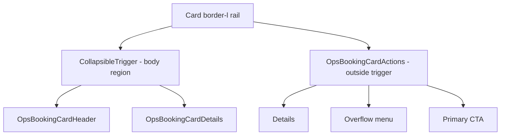

# Ops Booking Card — Mobile-First Visual Hierarchy Polish

## Goals

- Strengthen 5-layer hierarchy on every breakpoint:
  1. Customer name + status badge
  2. Party / date / time meta
  3. Operational chips (urgency, table)
  4. Details (contact, reference, notes)
  5. Utility actions (menu, secondary buttons)
- Mobile-first defaults; progressive enhancement at `sm`, `md`, `lg`.
- Tap-anywhere-on-body to expand on mobile; action footer stays interactive.
- No new tokens; reuse existing Tailwind theme (`success`, `warning`, `info`, `destructive`, `primary`, `muted`, `accent`, `border`, `ring`, `card`).
- No behavior, view-model, or policy changes.

## Breakpoint contract

- Mobile (default, < 640px)
  - Single column, generous vertical rhythm.
  - Card body acts as expand trigger; details collapse by default.
  - Primary CTA full-width; secondary actions inline above it.
- `sm` (≥ 640px)
  - Header becomes 2-column; details always visible.
  - Action footer becomes a single row, primary CTA right-aligned.
- `md` (≥ 768px)
  - Tighten header padding, normalize chip row inline with meta.
- `lg` (≥ 1024px)
  - Details grid expands to 4 columns (existing behavior preserved).

## Hierarchy tokens (apply consistently)

- Layer 1 text: `text-[15px] sm:text-base font-semibold text-foreground`
- Layer 2 text: `text-xs sm:text-sm text-muted-foreground`
- Layer 3 chips: subtle `bg-muted/40` neutral, status accents only when meaningful
- Layer 4 labels: `text-[10px] uppercase tracking-wider text-muted-foreground`
- Layer 5 controls: `variant="ghost"`, low contrast unless primary

## File-by-file changes

### 1. [src/components/features/dashboard/cards/OpsBookingCard.tsx](src/components/features/dashboard/cards/OpsBookingCard.tsx)

- Wrap header + details inside a single `CollapsibleTrigger asChild` region on mobile only:
  - Use a `
` that is interactive only at `sm:hidden` (via `pointer-events-none sm:pointer-events-auto` inversion, or a `sm:cursor-default sm:select-text` fallback) — simplest is to keep `Collapsible` and add a `CollapsibleTrigger` that covers header+details with `sm:pointer-events-none`.
  - Action footer stays outside the trigger so buttons remain reachable.
- Preserve existing className but soften hover at `sm+`:
  - `hover:shadow-md` only at `sm:hover:shadow-md` to avoid double-cue on mobile (where the entire body is tappable).
  - Add `active:bg-muted/30 sm:active:bg-transparent` for mobile feedback.
- Keep `border-l-[3px]` rail logic and `railClass` exactly as today.
- Pass `showCollapseToggle={false}` to `OpsBookingCardHeader` since the chevron icon button is replaced by full-body tap.

### 2. [src/components/features/dashboard/cards/OpsBookingCardHeader.tsx](src/components/features/dashboard/cards/OpsBookingCardHeader.tsx)

- Restructure header into three vertical sections on mobile:
  1. Identity row: avatar + name + status badge (right)
  2. Meta row: party, date, time chip
  3. Operational chip row: table chip + urgency badge + (optional) notes pill
- Promote name:
  - `text-base sm:text-[15px] font-semibold leading-tight`
  - Truncate with `line-clamp-1` on mobile, full label tooltip preserved.
- Demote meta:
  - `text-[11px] sm:text-xs text-muted-foreground`
  - Tight spacing `gap-x-2 gap-y-1`, monospace time pill kept but smaller.
- Add table chip into header (mobile-first), so table state is visible without expanding:
  - Assigned: neutral `bg-muted/50 text-foreground`
  - Unassigned: `bg-warning/10 text-warning border border-warning/20`
  - At `sm+`, this same info still appears inside details to avoid duplication; chip stays for consistent at-a-glance read.
- Status badge sizing locked to `size="sm"`, urgency badge stacked under status on `sm+`, inline on mobile.
- Remove the per-mobile `ChevronDown` icon button (replaced by full-body tap). Keep `hasNotes` "Notes" badge as a passive signal only.

### 3. [src/components/features/dashboard/cards/OpsBookingCardDetails.tsx](src/components/features/dashboard/cards/OpsBookingCardDetails.tsx)

- Maintain `1 / 2 / 4` column grid (`grid-cols-1 sm:grid-cols-2 lg:grid-cols-4`).
- Lower default contrast of `InfoTile`:
  - Label `text-[10px] font-semibold uppercase tracking-wider text-muted-foreground`
  - Value `text-[13px] leading-snug text-foreground`
- Notes tile: keep `border-primary/30 bg-primary/10` highlighted state when `notes.highlighted`; otherwise stay neutral.
- Tighten paddings on mobile, slightly looser on `sm+`:
  - Tile padding `p-2.5 sm:p-3`
  - Grid gap `gap-2 sm:gap-3`
- Keep `CollapsibleContent` open behavior on `sm+` (always visible).

### 4. [src/components/features/dashboard/cards/OpsBookingCardActions.tsx](src/components/features/dashboard/cards/OpsBookingCardActions.tsx)

- Mobile-first footer layout:
  - Stack: utility row (Details + overflow) on top, primary CTA full-width below.
  - Use `flex-col gap-2 sm:flex-row sm:items-center sm:justify-between sm:gap-3`.
- Primary CTA prominence:
  - Seat Guest: keep `bg-primary text-primary-foreground` (cleaner than current `bg-primary/10 text-primary`).
  - Finish: `variant="outline"` with `border-success/30 text-success hover:bg-success/10`.
  - Keep pending state spinner; widen to `w-full sm:w-auto sm:min-w-[140px]`.
- Demote utility controls:
  - Details: `variant="ghost" size="sm"` neutral text.
  - Overflow: `variant="ghost" size="icon"` `h-9 w-9 sm:h-8 sm:w-8`.
- Preserve `AlertDialog` no-show flow exactly.

## Mobile expand affordance

Mermaid sketch of interaction layering:

Behavior matrix:

- Mobile: tapping `TriggerBody` toggles `isOpen`; `Footer` buttons act normally.
- `sm+`: trigger becomes inert (`pointer-events-none`), details always rendered; footer unchanged.

## Accessibility

- `aria-labelledby={guest-name-${bookingId}}` retained on the `Card`.
- Trigger region: `aria-expanded`, `aria-controls={ops-booking-details-${bookingId}}`.
- Action footer remains a separate landmark with proper button labels.
- Maintain `motion-reduce:transition-none` on all transitions.

## Out of scope

- No view-model, policy, hook, or service changes.
- No theme/token additions; no dark-mode-specific tweaks beyond existing tokens.
- No copy changes.

## Verification (post-implementation)

- `pnpm run lint`
- `pnpm run typecheck`
- Manual mobile/desktop check on a real ops booking list route at 360 / 414 / 640 / 768 / 1024 / 1280 widths.
