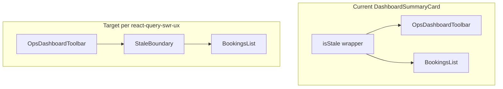

# Ops performance and SWR UX plan

## What to optimize first

The files you had open mix two concerns:

- **[`OpsBookingDialogDevHarness.tsx`](<src/app/(public)/__dev/ops-booking-dialog/ui/OpsBookingDialogDevHarness.tsx>)** — `__dev` harness for manual QA; not a shipped performance surface. Verify UI on a real shipped route.
- **[`react-query-swr-ux.md`](docs/technical/react-query-swr-ux.md)** + **[`StaleBoundary.test.tsx`](tests/components/StaleBoundary.test.tsx)** — define the **canonical** stale-while-revalidate UX for **production** ops.

**Recommendation:** Treat **ops dashboard bookings** as the primary target: it is where date/filter-driven keys, `keepPreviousData` on [`useOpsDashboardData`](src/hooks/ops/useOpsDashboardData.ts), and user perception of “speed” intersect.

## Current state (repo-specific)

1. **Hooks layer:** Many ops hooks already use `placeholderData: keepPreviousData` (e.g. [`useOpsDashboardData`](src/hooks/ops/useOpsDashboardData.ts), [`useOpsBookingsList`](src/hooks/ops/useOpsBookingsList.ts), [`useOpsBookingStatusSummary`](src/hooks/ops/useOpsBookingStatusSummary.ts), [`useOpsTableTimeline`](src/hooks/ops/useOpsTableTimeline.ts), [`useOpsMenu`](src/hooks/ops/useOpsMenu.ts), [`useOpsDualSync`](src/hooks/ops/useOpsDualSync.ts)). The doc’s “phase-1 hooks” list is **partly stale** relative to the codebase — worth refreshing when you touch the doc.

2. **Primitives exist but are not wired into feature UI:** [`getSwrUiState`](lib/query/swrUiState.ts) and [`StaleBoundary`](components/ui/stale-boundary.tsx) are covered by tests; **no** `src/components/**` consumer grep hit. The dashboard uses **ad hoc** flags in [`useOpsDashboardDataState`](src/components/features/dashboard/useOpsDashboardDataState.ts) (`isInitialLoading`, `isRefetching`, `isSummaryMismatch`) without `getSwrUiState`.

3. **Toolbar vs content rule is currently violated on purpose in code:** In [`DashboardSummaryCard.tsx`](src/components/features/dashboard/DashboardSummaryCard.tsx), `isStale` applies `opacity-50` and **`pointer-events-none`** to a wrapper that includes **both** [`OpsDashboardToolbar`](src/components/features/dashboard/OpsDashboardToolbar.tsx) and [`BookingsList`](src/components/features/dashboard/BookingsList). The SWR doc’s golden rule is the opposite: toolbar stays interactive; only the **list/grid body** gets `StaleBoundary`.

## Phase A — Shipped ops dashboard (highest value)

1. **Derive SWR flags from the real query** in [`useOpsDashboardDataState`](src/components/features/dashboard/useOpsDashboardDataState.ts) (or the parent hook that owns `summaryQuery`): call `getSwrUiState(summaryQuery)` and expose at least:
   - `isPlaceholderStale` (RQ key changed, previous row shown)
   - `isInitialLoad` / `isRefetching` if you want to replace hand-rolled booleans over time.

2. **Compose with domain stale** exactly as the doc shows for the dashboard:
   - `isStaleContent = getSwrUiState(summaryQuery).isPlaceholderStale || isSummaryMismatch`

3. **Refactor [`DashboardSummaryCard`](src/components/features/dashboard/DashboardSummaryCard.tsx)** so that:
   - [`OpsDashboardToolbar`](src/components/features/dashboard/OpsDashboardToolbar.tsx) sits **outside** any stale dimming / `StaleBoundary`.
   - Only the bookings list region is wrapped in `<StaleBoundary isStale={…}>` using the composed boolean (prefer the primitive for `aria-busy` and motion-safe blur per [`stale-boundary.tsx`](components/ui/stale-boundary.tsx)).
   - Revisit `pointer-events-none` on the list region only if you still need to block clicks during mismatch; avoid applying it to filters/search.

4. **Header “Updating…” behavior:** [`OpsDashboardClient`](src/components/features/dashboard/OpsDashboardClient.tsx) already passes `isRefetching` into header/summary controls; align semantics with `getSwrUiState`’s `isRefetching` (same-key refresh vs placeholder stale) so the badge matches the three-state model in the doc.

5. **Verification:** Manual pass on the **real** ops dashboard route (not only `__dev`) after changes: change date, change filter, confirm toolbar stays usable during placeholder stale, list shows stale treatment, and a11y (`aria-busy`) is acceptable.

## Phase B — Doc and audit hygiene (small)

- Update [`docs/technical/react-query-swr-ux.md`](docs/technical/react-query-swr-ux.md) **Hooks audit status** to match grep reality, and add a short **“Feature adoption”** bullet: dashboard now uses `StaleBoundary` + `getSwrUiState` where applicable.

## Phase C — `OpsBookingDialogDevHarness` (optional, low priority)

- Inline `async () => {}` handlers cause new function identities each render; [`BookingDialog`](src/components/features/dashboard/booking-details/BookingDialog.tsx) `useMemo` dependency lists include `onCheckIn`, etc., so **stable `useCallback` noops** reduce unnecessary `primaryAction` recomputation. Impact is tiny on a static harness; only worth doing if you use the harness for Profiler comparisons.

## Phase D — Only if profiling shows a real bottleneck

- **Prefetch:** `queryClient.prefetchQuery` on hover/focus for predictable next navigation (e.g. date cell in calendar) — add only after confirming network cost in DevTools.
- **`staleTime` tuning:** per-hook in ops services where refetch frequency is measurable; avoid global `placeholderData` defaults.
- **Bundle:** [`OpsDashboardDialogs`](src/components/features/dashboard/OpsDashboardDialogs.tsx) already uses `next/dynamic` for some dialogs; extend only if bundle analyzer points at a specific heavy import.

## Out of scope unless you expand the goal

- Broad `React.memo` / `useCallback` sweeps without a identified hot path.
- Optimizing the dev harness as a substitute for production verification.
