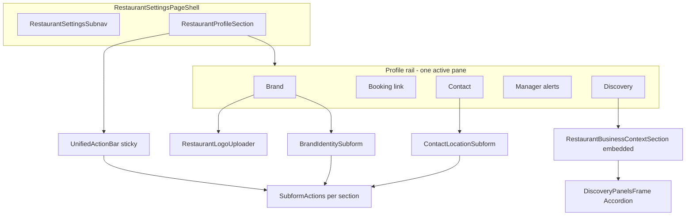

# Restaurant profile in-section field IA improvements

**Risk tier:** Medium (single ops surface, UI-only; no API/schema changes)
**Route:** `http://app.localhost:3000/settings/restaurant/profile`
**Task folder (required before edits):** `tasks/profile-field-ia-YYYYMMDD-HHMM/` with `research.md`, `plan.md`, `todo.md`, `verification.md` per [docs/sdlc/task-harness.md](docs/sdlc/task-harness.md)

## Current state (baseline)

**Already done (out of scope):** split subforms, booking rules on Availability ([`AvailabilityOccasionsCommandCenter.tsx`](src/components/features/restaurant-settings/AvailabilityOccasionsCommandCenter.tsx)), command-center rail, per-section PATCH payloads.

**Pain to fix:** contact grid vs callout mismatch, duplicate save paths, discovery accordion nesting, logo label mismatch, booking preview shows path only.

---

## Phase 1 — Field grouping and copy (small, ship first)

### 1a. Contact section: match callouts with sub-blocks

**File:** [`components/ops/restaurants/RestaurantDetailsForm.tsx`](components/ops/restaurants/RestaurantDetailsForm.tsx) — `ContactLocationSubform`

Replace the current field order (timezone+email, phone+address, map+review) with three labeled groups using existing primitives (`Separator`, `p` subheadings — same pattern as manager callouts):

| Group          | Heading          | Fields (grid `sm:grid-cols-2` unless noted)                                                    |
| -------------- | ---------------- | ---------------------------------------------------------------------------------------------- |
| Location       | `Location`       | Timezone (required), Address                                                                   |
| Public contact | `Public contact` | Phone, Email                                                                                   |
| After visit    | `After visit`    | Guest review link (full width); Map link can sit in Location row 2 or full width below address |

Keep the top three muted callout cards OR drop them if redundant once subheadings exist (prefer **subheadings only** to reduce vertical noise — pick one in implementation, not both).

Add one-line scoped hints on map/review fields:

- Map: _Directions link for guests (Google Maps)._
- Review: _Post-visit review link; not the same as website/menu links in Discovery._

**Tests:** Extend [`tests/components/RestaurantDetailsForm.test.tsx`](tests/components/RestaurantDetailsForm.test.tsx) — assert group headings render and save payload unchanged.

### 1b. Logo copy alignment

**File:** [`src/components/features/restaurant-settings/RestaurantLogoUploader.tsx`](src/components/features/restaurant-settings/RestaurantLogoUploader.tsx)

- Label: **Restaurant logo** (not “Email branding”)
- Help: _Shown on the guest booking page and in booking emails._
- Keep upload/remove behavior unchanged.

**Tests:** Update [`tests/components/RestaurantLogoUploader.test.tsx`](tests/components/RestaurantLogoUploader.test.tsx) text expectations.

### 1c. Full public booking URL preview

**File:** [`components/ops/restaurants/RestaurantDetailsForm.tsx`](components/ops/restaurants/RestaurantDetailsForm.tsx) — `AdvancedIdentitySubform`

- Add helper in [`lib/site-url.ts`](lib/site-url.ts) (or colocate in form model): `buildPublicBookingUrl(slug: string): string | null` using `getTrustedSiteOrigin()` + `/restaurants/${slug}/book` (framework-agnostic; safe on client).
- Preview panel shows:
  - **Relative path** (existing)
  - **Full URL** (new, `break-all font-mono text-xs`)
  - **Copy full URL** button (primary copy action); keep path copy as secondary or remove duplicate if redundant.
- Local dev: `getTrustedSiteOrigin()` already derives root from `app.localhost` via `rootOriginFromAppOrigin` — document expected `localhost:3000` URL in `verification.md`.

**Tests:** `RestaurantDetailsForm.test.tsx` — mock `getTrustedSiteOrigin` / env; assert full URL renders when slug present.

---

## Phase 2 — Single primary save path

**Goal:** Sticky [`UnifiedActionBar`](src/components/features/restaurant-settings/profile/UnifiedActionBar.tsx) owns **Save**; inline forms keep **Cancel changes** + status only.

### Implementation

1. Add optional prop to subform props in `RestaurantDetailsForm.tsx`:
   - `actionPlacement?: 'inline' | 'stickyBar'` (default `'inline'` for tests and any future non-profile consumers).
2. Refactor `SubformActions`:
   - `inline`: current behavior (Cancel + Submit).
   - `stickyBar`: render only status line + **Cancel changes** (no Submit button).
3. Pass `actionPlacement="stickyBar"` from [`RestaurantProfileSection.tsx`](src/components/features/restaurant-settings/RestaurantProfileSection.tsx) into all four subforms.
4. Enhance `UnifiedActionBar` when dirty:
   - Always show **Save** for active section (`form={formId}`).
   - Add **Cancel changes** that dispatches `form` reset — implement via optional `onCancelActive?: () => void` callback from `RestaurantProfileSection` (expose `resetDraft` from subforms through ref or lifted reset handlers per dirty key).

**Discovery:** unchanged — per-family save stays in panels; bar copy already says discovery saves individually.

**Tests:**

- [`tests/components/RestaurantProfileSection.test.tsx`](tests/components/RestaurantProfileSection.test.tsx): dirty brand section → sticky bar has Save, inline form has no duplicate Save; Cancel restores draft.
- [`tests/components/RestaurantDetailsForm.test.tsx`](tests/components/RestaurantDetailsForm.test.tsx): default `inline` still has Submit (no regression).

---

## Phase 3 — Flatten embedded discovery (largest change)

**Files:**

- [`src/components/features/restaurant-settings/RestaurantBusinessContextPanels.tsx`](src/components/features/restaurant-settings/RestaurantBusinessContextPanels.tsx) — `DiscoveryPanelsFrame`
- [`src/components/features/restaurant-settings/RestaurantBusinessContextSection.tsx`](src/components/features/restaurant-settings/RestaurantBusinessContextSection.tsx)

### Behavior

When `embedded === true` (Profile only today):

- Render **stacked sections** instead of `Accordion`:
  - Each family: `Card variant="compact"` with `id={`profile-discovery-${family}`}`, `CardHeader` (title from `TAB_LABELS`, description from `DISCOVERY_SECTION_DESCRIPTIONS`), dirty/error badges, `CardContent` with existing panel child.
  - Order: `DISCOVERY_SECTION_ORDER` from [`businessContextModel.ts`](src/components/features/restaurant-settings/businessContextModel.ts) (`businessDetails` → `categories` → `links` → `attributes` → `serviceItems` → `serviceAreas`).
  - All panels **expanded**; scroll within discovery pane (no `activeTab` accordion state required for embedded — simplify `editor.setActiveTab` usage when embedded).
- When `embedded === false`: keep current accordion (tests use non-embedded with accordion).

Trim top noise in embedded mode:

- Collapse “About Google suggestions” `Alert` into a single-line muted note + link to GBP (full alert stays acceptable if product wants it — default to shorter).

**Tests:** Rewrite embedded case in [`tests/components/RestaurantBusinessContextSection.test.tsx`](tests/components/RestaurantBusinessContextSection.test.tsx) (lines ~226–258):

- No accordion `aria-expanded` toggling required for embedded.
- All six section titles visible as headings without clicking.
- Each section still has its Save button.
- Non-embedded test still uses accordion triggers.

**Stop rule:** Do not change save payloads, `saveFamily` logic, or replace-all semantics (known data-integrity area in DeepSec backlog).

---

## Phase 4 — Rail polish (readiness-aligned steps)

**Files:**

- [`src/components/features/restaurant-settings/profile/profileSections.ts`](src/components/features/restaurant-settings/profile/profileSections.ts)
- [`src/components/features/restaurant-settings/RestaurantProfileSection.tsx`](src/components/features/restaurant-settings/RestaurantProfileSection.tsx)
- [`src/components/features/restaurant-settings/shared/RestaurantSettingsCommandCenter.tsx`](src/components/features/restaurant-settings/shared/RestaurantSettingsCommandCenter.tsx) — only if rail item needs a `step` slot

Add optional `setupStep?: number` on `ProfileSectionDefinition` (1–5 matching readiness narrative):

1. Brand
2. Booking link
3. Contact
4. Manager alerts
5. Discovery (optional)

Render step prefix in rail label (e.g. `1 · Brand`) via existing `SettingsSectionNav` items — **do not reorder rail** (keeps readiness-first flow); steps explain order rather than reordering to contact-first.

**Tests:** `RestaurantProfileSection.test.tsx` — rail shows step labels.

---

## Verification (required)

| Check                | Command / surface                                                                                                                                                                                                                                                        |
| -------------------- | ------------------------------------------------------------------------------------------------------------------------------------------------------------------------------------------------------------------------------------------------------------------------ |
| Unit                 | `pnpm exec vitest run tests/components/RestaurantDetailsForm.test.tsx tests/components/RestaurantLogoUploader.test.tsx tests/components/RestaurantProfileSection.test.tsx tests/components/RestaurantBusinessContextSection.test.tsx`                                    |
| Lint / types         | `pnpm run lint` && `pnpm run typecheck`                                                                                                                                                                                                                                  |
| Browser (real route) | `http://app.localhost:3000/settings/restaurant/profile` at 1280 / 768 — per [nabatable-ui-proof](.codex/skills/nabatable-ui-proof/SKILL.md): section switch, contact groups visible, sticky save without duplicate, discovery sections scrollable, copy full booking URL |
| Optional e2e touch   | Extend [`tests/e2e/ops-restaurant-settings-command-center.spec.ts`](tests/e2e/ops-restaurant-settings-command-center.spec.ts) profile assertions if stable selectors exist                                                                                               |

Record outcomes in `tasks/.../verification.md`.

---

## Non-goals

- No DB / PATCH schema changes
- No rail reorder to contact-before-booking (steps only)
- No refactor of `RestaurantBusinessContextPanels` field editors beyond layout wrapper
- No GBP dual-sync UI changes

---

## Suggested PR / commit sequence

1. Phase 1 (grouping + copy + URL)
2. Phase 2 (save dedupe)
3. Phase 3 (discovery flatten)
4. Phase 4 (rail steps)

Can ship as one PR if review size is acceptable; phases keep commits reviewable.
