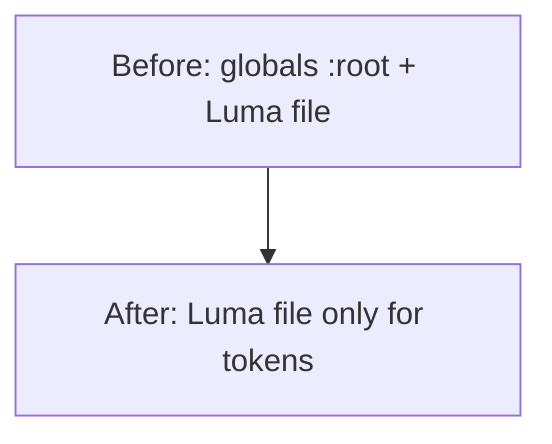

# Remove legacy design system and leftovers

## What “legacy” means here (scoped to styling)

This is **not** about server “legacy” APIs, booking tokens, or dual-sync—only **styling and theme leftovers** from older stacks (pre-Luma Slate theme, unused guest theme files, DaisyUI-era config, and the “SR” alias layer).

## Current problems (evidence)

1. **Orphan CSS — never imported**
   - [`styles/base.css`](styles/base.css): full Slate `:root` + “Nab a Table Cereal App” font; **no `@import` anywhere** (only a stale comment in [`styles/animations.css`](styles/animations.css)).
   - [`styles/themes/guest.css`](styles/themes/guest.css) and [`styles/themes/guest-enhanced.css`](styles/themes/guest-enhanced.css): alternate guest palettes; **not imported** by [`src/app/globals.css`](src/app/globals.css) or reserve.
   - [`styles/animations.css`](styles/animations.css): keyframes overlap what is already inlined in [`src/app/globals.css`](src/app/globals.css) and is **not imported**; safe to delete after confirming no external reference.

2. **SR token layer (“deprecation path”) — unused in source**
   - [`styles/tokens.css`](styles/tokens.css): `--sr-*` variables + `.sr-container`, `.sr-stack-*`, `.sr-surface`, `.sr-chip`.
   - Imported by [`src/app/globals.css`](src/app/globals.css) (line 3) and [`reserve/main.tsx`](reserve/main.tsx) (line 2).
   - [`tailwind.config.js`](tailwind.config.js) exposes **Legacy SR Tokens** as colors (`sr-primary`, …) and radii (`sr-sm`, …)—**no matches** in `*.tsx`/`*.ts` for those utilities (reserve only uses Tailwind’s `sr-only`, which is unrelated).  
     **Action:** remove `tokens.css`, drop its imports, and delete the SR entries from `tailwind.config.js`.

3. **Duplicate semantic tokens — two sources of truth**
   - [`styles/design-system/public-guest.tokens.css`](styles/design-system/public-guest.tokens.css) already applies Luma to `:root`, `[data-theme='guest']`, `[data-theme='app']`, and `.guest-theme` (lines 8–11).
   - [`src/app/globals.css`](src/app/globals.css) repeats a large `:root` / `.dark` block (from ~line 18 through ~191) with the **same semantic variables** (primary, sidebar, charts, radii, etc.). Later rules win in the cascade; keeping both is redundant and error-prone.  
     **Action:** remove the duplicated token blocks from `globals.css` and keep **one** Luma source (`public-guest.tokens.css`). Retain in `globals.css` only what is not token-related: resets, typography tweaks, focus/touch, print rules, keyframes, and any app-specific utilities (e.g. `.sr-only` if you keep the hand-rolled version vs Tailwind plugin).

4. **DaisyUI-era config**
   - [`types/config.ts`](types/config.ts) `Theme` is a long union (cupcake, dracula, …) copied from DaisyUI; [`config/app.config.ts`](config/app.config.ts) still comments about DaisyUI and `data-theme=`. Nothing in the repo references `config.colors.theme` by code search.  
     **Action:** narrow `Theme` to what the product actually uses (e.g. `"light" | "dark" | ""`) and refresh comments to Radix Luma / `data-theme` for **guest vs app**, not DaisyUI themes.

5. **Stale internal doc**
   - [`.cursor/plans/unify_guest_luma_ds_cd5b2926.plan.md`](.cursor/plans/unify_guest_luma_ds_cd5b2926.plan.md) references `styles/themes/app.css`, which **does not exist** in the repo; ops density is in `globals.css` + Luma tokens today. Update or archive that section when you touch this work so the team is not misled.

## Optional follow-up (same theme, separate cleanup)

Inside [`public-guest.tokens.css`](styles/design-system/public-guest.tokens.css), the block labeled **“Legacy aliases consumed by existing guest pages”** (e.g. `--color-primary-500`, `--guest-text-*`) can be trimmed **after** a quick grep for those variable names in `*.tsx` / CSS modules. If nothing references them, fold remaining consumers to `--pg-*` / shadcn semantics and delete the alias block.

## Verification (required by repo rules)

- `pnpm run lint` and `pnpm run typecheck`.
- **Browser:** one shipped **guest/public** route and one **`/app/**`\*\* route to confirm tokens still resolve (primary, background, sidebar, typography).
- **Reserve:** smoke the reserve bundle after removing `tokens.css` import (build or dev).

## Risk note

Touching global CSS and Tailwind theme extensions is **medium/high surface area**; per [`docs/sdlc/risk-tier-workflow.md`](docs/sdlc/risk-tier-workflow.md), consider a task folder `tasks/remove-legacy-ds-YYYYMMDD-HHMM/` with a short note of files changed and spot-check URLs.
