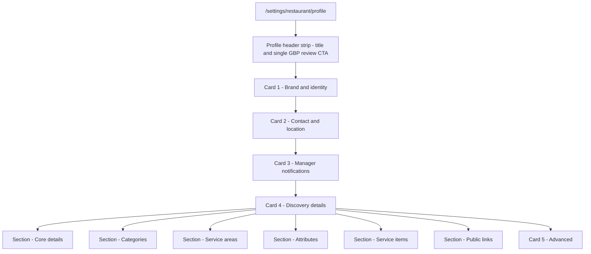

## Restaurant Profile IA reorganization

### Current pain (IA only)

`/settings/restaurant/profile` today renders two cards driven by [`RestaurantProfileSection.tsx`](src/components/features/restaurant-settings/RestaurantProfileSection.tsx):

- One mega-card "Restaurant Profile" with a single submit button covering identity, contact, Google links, reservation timing, booking policy, manager SMS, and slug (in an inner accordion).
- A second card "Profile discovery settings" wrapping an accordion which wraps another component with 6 tabs (Core details, Links, Categories, Service areas, Attributes, Service items).

Concrete IA collisions:

- Reservation timing (`reservationIntervalMinutes`, `reservationDefaultDurationMinutes`, `reservationLastSeatingBufferMinutes`, `reservationLifecycleGraceMinutes`) and `bookingPolicy` live on Profile, but [`/settings/restaurant/availability`](<src/app/app/(app)/settings/restaurant/availability/page.tsx>) is the canonical scheduling page.
- GBP affordances appear three times near the top: header `<a href=...>Review GBP draft</a>`, an inline verification summary, and per-field GBP badges.
- "Links" tab inside Discovery (website / menu / social) lives next to ad-hoc `googleMapUrl` / `googleReviewUrl` fields in the main details form.
- Card -> Accordion -> Tabs is three nesting levels for one job.

### Target IA (Profile page becomes a stack of focused cards)

1. Page header strip: title, GBP connection status pill, one CTA (Review GBP draft). Removes the duplicate inline verification banner.
2. Card "Brand & identity": logo uploader, restaurant name, business description.
3. Card "Contact & location": timezone, contact email, contact phone, address, Google Maps URL, Google Review URL. (Google links stay on Profile; data model unchanged.)
4. Card "Manager notifications": manager notification phone + daily SMS toggle.
5. Card "Discovery details" (flattened, no accordion, no tabs): six clearly headed subsections in this order: Core details, Categories, Service areas, Attributes, Service items, Public links. Each subsection keeps its own dirty/save action (matches current per-family save behavior).
6. Card "Advanced": slug (currently buried in an inner accordion).

### Availability page gains a "Booking rules" card

Add a new card above the existing `AvailabilityScheduleManager` in [`AvailabilityOccasionsCommandCenter.tsx`](src/components/features/restaurant-settings/AvailabilityOccasionsCommandCenter.tsx):

- New component `BookingRulesCard` owning `reservationIntervalMinutes`, `reservationDefaultDurationMinutes`, `reservationLastSeatingBufferMinutes`, `reservationLifecycleGraceMinutes`, `bookingPolicy`, saving via the same `useOpsUpdateRestaurantDetails` hook so the API surface is unchanged.

### Data model: nothing changes

- All fields stay on the same DB columns and the same PATCH endpoint at [`src/app/api/ops/restaurants/[id]/route.ts`](src/app/api/ops/restaurants/[id]/route.ts).
- The shared schema ([`schema.ts`](src/app/api/ops/restaurants/schema.ts)) is unchanged.
- The mutation hook `useOpsUpdateRestaurantDetails` is unchanged and called from multiple smaller subforms.

### Implementation approach

- Split [`RestaurantDetailsForm.tsx`](components/ops/restaurants/RestaurantDetailsForm.tsx) into focused subforms:
- `BrandIdentitySubform` (name, businessDescription)
- `ContactLocationSubform` (timezone, contactEmail, contactPhone, address, googleMapUrl, googleReviewUrl)
- `ManagerNotificationsSubform` (managerNotificationPhone, managerDailySummaryEnabled)
- `AdvancedIdentitySubform` (slug)
- `BookingRulesSubform` (interval, duration, buffer, grace, bookingPolicy) - rendered only on Availability page
- Each subform uses `useOpsUpdateRestaurantDetails` directly with a partial payload.
- Each subform reports its own `onDirtyChange`; `RestaurantProfileSection` ORs them into a single `useRegisterOpsUnsavedChanges` registration.
- Refactor [`RestaurantProfileSection.tsx`](src/components/features/restaurant-settings/RestaurantProfileSection.tsx) to render the new card stack and drop the `Accordion` wrapper around discovery.
- Update [`RestaurantBusinessContextSection.tsx`](src/components/features/restaurant-settings/RestaurantBusinessContextSection.tsx) so that when `embedded=true` it renders six labeled subsections instead of `<Tabs>`. Keep each family's existing Save / Reset / Add controls unchanged.
- Add [`AvailabilityOccasionsCommandCenter.tsx`](src/components/features/restaurant-settings/AvailabilityOccasionsCommandCenter.tsx) integration of `BookingRulesSubform` above `AvailabilityScheduleManager`.
- Preserve scroll anchors (`#profile-identity`, `#profile-booking`, `#profile-notifications`, `#profile-advanced`, `#availability-schedule`) where present, and add `#profile-discovery` and `#booking-rules` for the new sections.

### Risks and mitigations

- Risk: Touched tests will need updates: [`tests/components/RestaurantDetailsForm.test.tsx`](tests/components/RestaurantDetailsForm.test.tsx) and [`tests/components/RestaurantBusinessContextSection.test.tsx`](tests/components/RestaurantBusinessContextSection.test.tsx) currently assert tab triggers and a single submit button.
- Mitigation: Update tests to assert the new sectioned structure and per-subform saves. Cover the relocated booking-rules fields with an Availability test.
- Risk: Splitting one form into multiple subforms changes save semantics from "one big save" to "save per card".
- Mitigation: This matches the existing Discovery section behavior; keep button labels explicit ("Save brand & identity", "Save contact details", etc.) and surface a single page-level dirty banner via `useRegisterOpsUnsavedChanges`.
- Risk: This is a medium-risk change spanning multiple forms and save flows.
- Mitigation: Sequence the implementation and record the verification results for each save flow.

### Validation

- Real ops route `/settings/restaurant/profile` and `/settings/restaurant/availability` browser checks at 1280, 1024, 768 widths.
- `pnpm run lint` and `pnpm run typecheck`.
- `pnpm exec vitest run tests/components/RestaurantDetailsForm.test.tsx tests/components/RestaurantBusinessContextSection.test.tsx`.
- Save flow smoke: change a field in each card on Profile and on Availability `BookingRulesCard`, confirm individual saves, refresh, confirm persistence.
