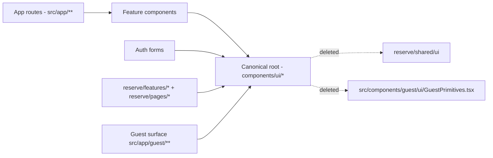

## Goal

Every JSX in the repo (Ops + Guest + reserve/\* + dashboard/auth) renders through a primitive from a single canonical shadcn UI root, with zero banned-lib imports, zero native renderables, zero parallel UI systems. Enforced in CI.

Ad-hoc Tailwind color tokens are explicitly out of scope.

## Audit-validated current state

Snapshot from a read-only scan of this repo:

- Two shadcn roots coexist (allowed by `ALLOWED_UI_ROOTS`):
  - [components/ui](components/ui) — 37 primitives (canonical going forward)
  - [src/components/ui](src/components/ui) — 2 primitives (`calendar.tsx`, `copy-button.tsx`)
- Banned-lib imports outside UI roots: 0 (already clean)
- Stale backup dir [components/ui/.backup-20251003](components/ui/.backup-20251003) — empty, effectively gone; one stray file remains: `components/ui/calendar.tsx.removed-20251003-163739`
- Parallel UI primitive systems:
  - [reserve/shared/ui/](reserve/shared/ui) — 19 files; only 1 external consumer: [reserve/pages/RouteError.tsx](reserve/pages/RouteError.tsx) imports `Icon` from `@reserve/shared/ui/icons`
  - [src/components/guest/ui/GuestPrimitives.tsx](src/components/guest/ui/GuestPrimitives.tsx) — 0 consumers (orphan)
- Native renderables outside UI roots (real targets, excluding `components/ui/*` and `tests/**`):
  - [components/auth/GuestSignInForm.tsx](components/auth/GuestSignInForm.tsx)
  - [src/app/error.tsx](src/app/error.tsx)
  - [src/app/global-error.tsx](src/app/global-error.tsx)
  - [reserve/pages/RouteError.tsx](reserve/pages/RouteError.tsx)
  - [src/components/restaurants/PublicSections.tsx](src/components/restaurants/PublicSections.tsx)

Estimated current coverage: ~90%. Remaining work is concentrated in ~7 files plus script + CI changes.

## Definition of done

1. Exactly one shadcn primitives root: [components/ui](components/ui).
2. No file outside that root imports `@radix-ui/*`, `@headlessui/react`, `@floating-ui/*`, `@ariakit/*`, `react-tooltip`.
3. No file outside that root renders native `<button> <input> <select> <textarea> <label> <form> <table> <dialog> <datalist> <option> <iframe>`, except `tests/**`.
4. No app surface imports `reserve/shared/ui/*` or `src/components/guest/ui/GuestPrimitives.tsx`; both deleted.
5. `pnpm node scripts/check-no-shadcn.mjs --primitives-only` passes repo-wide with 0 findings (color advisory exempted).
6. CI blocks regressions on every PR.

## Target structure

## Execution: 8 sequenced PRs

### PR #0 — Baseline bootstrap

- Capture the current primitive findings and a verification checklist for the sequenced PRs.

### PR #1 — Single canonical UI root

- Move [src/components/ui/calendar.tsx](src/components/ui/calendar.tsx) into [components/ui/calendar.tsx](components/ui/calendar.tsx) (or merge variants).
- Move [src/components/ui/copy-button.tsx](src/components/ui/copy-button.tsx) into [components/ui/copy-button.tsx](components/ui/copy-button.tsx).
- Update consumer imports from `@/components/ui/calendar` and `@/components/ui/copy-button` if they currently resolve to `src/components/ui`.
- Delete stray `components/ui/calendar.tsx.removed-20251003-163739`.
- In [scripts/check-no-shadcn.mjs](scripts/check-no-shadcn.mjs) reduce `ALLOWED_UI_ROOTS` to `['components/ui']`.
- Verification: `pnpm run lint`, `pnpm run typecheck`, run `pnpm node scripts/check-no-shadcn.mjs` to ensure no new findings.

### PR #2 — `--primitives-only` mode + baseline

In [scripts/check-no-shadcn.mjs](scripts/check-no-shadcn.mjs):

- Add `--primitives-only` flag. In this mode:
  - Promote `native-renderable` and `standalone-anchor` from `findings.advisory` to `findings.blocking`.
  - Keep `ad-hoc-token` advisory only.
  - Fail with non-zero exit if any non-color blocking finding exists.
- Add `--baseline=<path>` writer that emits `{ blocking: { kind: count }, advisory: { kind: count } }` JSON.
- Capture the baseline in `config/shadcn-primitives-baseline.json`.
- Verification: run all three modes (default, `--strict`, `--primitives-only`) and record the outputs in the PR verification notes.

### PR #3 — Migrate the one `reserve/shared/ui` consumer

- In [reserve/pages/RouteError.tsx](reserve/pages/RouteError.tsx) replace `import { Icon } from '@reserve/shared/ui/icons'` with either:
  - direct lucide-react icon import (preferred, used elsewhere), or
  - a composed icon helper under [src/components/shared/](src/components/shared) if multiple files need it.
- Verification: render `RouteError` on a real shipped route; grep proves zero remaining `@reserve/shared/ui` or `@shared/ui` imports outside the directory itself.

### PR #4 — Delete parallel UI systems

- Delete [reserve/shared/ui/](reserve/shared/ui) directory (19 files).
- Delete [src/components/guest/ui/GuestPrimitives.tsx](src/components/guest/ui/GuestPrimitives.tsx) and update its `index.ts` if present.
- Verification: `pnpm run lint`, `pnpm run typecheck`, repo grep returns 0 references.

### PR #5 — Replace native renderables (5 files)

For each file below, replace native HTML primitives with shadcn equivalents (`Button`, `Card`, `Input`, `Label`, `Form`, `Select`, `Tabs`, etc.). Use `Button asChild` for anchors. Mirror patterns already used in [components/auth/OpsSignInForm.tsx](components/auth/OpsSignInForm.tsx).

- [components/auth/GuestSignInForm.tsx](components/auth/GuestSignInForm.tsx)
- [src/app/error.tsx](src/app/error.tsx) — Next.js error boundary; restricted to client primitives, use `Button` + `Card` only.
- [src/app/global-error.tsx](src/app/global-error.tsx) — same constraint.
- [reserve/pages/RouteError.tsx](reserve/pages/RouteError.tsx)
- [src/components/restaurants/PublicSections.tsx](src/components/restaurants/PublicSections.tsx)

Verification: browser-verify each route (`/auth/signin` guest path, `/restaurants/[slug]`, error fallbacks via forced exception). Record screenshots and notes with the PR.

### PR #6 — Whole-repo scan + repo-wide bans

In [scripts/check-no-shadcn.mjs](scripts/check-no-shadcn.mjs):

- Extend `SCAN_ROOTS` to include `src/app/(public)`, `src/app/guest`, `src/components`, `components`, `reserve`.
- Rename `BANNED_OPS_REACHABLE_IMPORT_PATTERNS` to `BANNED_REACHABLE_IMPORT_PATTERNS` and apply to all reachable files (not just ops-reachable).
- Exclude `tests/**` and `**/__stories__/**` from the primitives gate.
- Refresh `config/shadcn-primitives-baseline.json` — it must show 0 blocking findings under `--primitives-only`.

### PR #7 — CI gate + repository documentation

- Add CI step running `pnpm node scripts/check-no-shadcn.mjs --primitives-only` on every PR (likely in the existing GitHub Actions / lint workflow).
- Document the invariant in the repository README:
  > Shadcn primitive layer is single-rooted at `components/ui/*`. No native HTML primitives or parallel UI systems are allowed in app code; `pnpm node scripts/check-no-shadcn.mjs --primitives-only` is the gate.
- Verification: open a deliberately-broken PR locally (e.g., add `<button>` somewhere) and confirm CI fails.

## Risks and mitigations

- Risk: `reserve/shared/ui` consumers depend on subtle styling differences. Mitigation: only 1 real consumer; migrate with visual parity check on a real shipped route.
- Risk: Next.js root error files restrict client features. Mitigation: keep migration to shadcn `Button` + `Card` only; do not add providers.
- Risk: removing `src/components/ui` breaks existing import paths. Mitigation: PR #1 codemod-grep all `@/components/ui/calendar` and `@/components/ui/copy-button` consumers and verify Next resolves to the canonical `components/ui` path.
- Risk: tests using native `<input>`/`<button>` ([tests/components/OpsShell.test.tsx](tests/components/OpsShell.test.tsx)). Mitigation: explicit `tests/**` exclusion in PR #6.

## Out of scope

- Ad-hoc color/token migration (kept advisory).
- Ops/guest theme split.
- Logic/state/data-layer refactors inside feature components.
