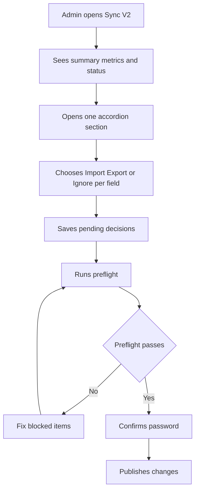

# Production-Ready Sync V2 Admin UI

## Goal

Deliver a polished `SyncV2Shell` experience that feels intentional for operations admins (not internal tooling), with clear decision workflow, section accordion review, and cleaner action flow than V1.

## Target files

- [`/Users/amankumarshrestha/LapenInns Project/nabatableLP/src/components/features/restaurant-settings/google-business-profile/v2/SyncV2Shell.tsx`](/Users/amankumarshrestha/LapenInns%20Project/nabatableLP/src/components/features/restaurant-settings/google-business-profile/v2/SyncV2Shell.tsx)
- [`/Users/amankumarshrestha/LapenInns Project/nabatableLP/src/components/features/restaurant-settings/google-business-profile/v2/V2FieldDecisionRow.tsx`](/Users/amankumarshrestha/LapenInns%20Project/nabatableLP/src/components/features/restaurant-settings/google-business-profile/v2/V2FieldDecisionRow.tsx)
- [`/Users/amankumarshrestha/LapenInns Project/nabatableLP/src/components/features/restaurant-settings/google-business-profile/v2/V2PreflightDialog.tsx`](/Users/amankumarshrestha/LapenInns%20Project/nabatableLP/src/components/features/restaurant-settings/google-business-profile/v2/V2PreflightDialog.tsx)
- (Optional small copy touch if needed) [`/Users/amankumarshrestha/LapenInns Project/nabatableLP/src/components/features/restaurant-settings/google-business-profile/GoogleBusinessProfileSection.tsx`](/Users/amankumarshrestha/LapenInns%20Project/nabatableLP/src/components/features/restaurant-settings/google-business-profile/GoogleBusinessProfileSection.tsx)

## Implementation approach

1. Replace the current flat per-section cards in `SyncV2Shell` with a V1-inspired admin shell structure:
   - Clear header block (title, short explanatory copy, snapshot time).
   - High-level progress/status chips (resolved/import/export/unresolved counts).
   - Accordion-based sections (single open by default) for focused review.
   - Persistent/sticky bottom action bar for save + preflight/publish actions.
2. Normalize information architecture for admins:
   - Show section labels and human-friendly field labels first.
   - Hide raw internal identifiers by default (section keys / raw field keys).
   - Keep technical metadata only in subtle helper text or remove when not needed.
3. Upgrade `V2FieldDecisionRow` visual hierarchy and readability:
   - Better side-by-side value comparison with stronger labels.
   - Normalize value rendering for arrays/objects into readable text blocks.
   - Keep action choices prominent and obvious (Import / Export / Ignore) with state clarity.
4. Improve preflight dialog clarity and confidence before publish:
   - Cleaner summary of planned changes and direction.
   - Better blocked/error presentation and actionable messaging.
   - Keep password confirmation flow but with admin-oriented copy.
5. Ensure shadcn-first consistency and responsiveness for ops layouts.

## UX flow (target)

## Validation

- Run lint/type checks on edited UI files.
- Verify no new lint diagnostics in touched files.
- Manual visual check on the shipped ops route for spacing, hierarchy, sticky CTA behavior, and accordion usability.

## Risks and mitigations

- Risk: Overly aggressive simplification may hide needed context.
  - Mitigation: Keep concise, non-intrusive helper copy where decisions could be ambiguous.
- Risk: Sticky action bar clashes with existing page layout.
  - Mitigation: Reuse V1 sticky spacing patterns and test in common viewport sizes.
