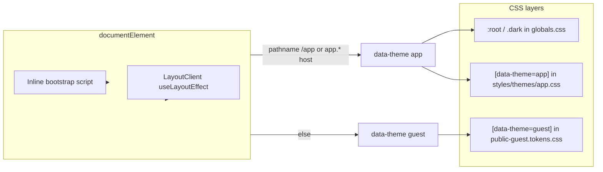

# 100% Radix Luma (ops + guest)

## Goal

**One design system: full Radix Luma everywhere**—not “Luma colors + optional ops density.” Ops must use the same semantic variables, type scale, radii, and motion as defined in [`GUEST_FACING_DESIGN_SYSTEM.md`](GUEST_FACING_DESIGN_SYSTEM.md) and implemented in [`styles/design-system/public-guest.tokens.css`](styles/design-system/public-guest.tokens.css) / [`styles/design-system/public-guest.utilities.css`](styles/design-system/public-guest.utilities.css). Shadcn primitives should resolve identically on guest and ops routes.

## Current split (why ops is not Luma today)

- **`resolveDocumentThemeForPathname`** ([`lib/theme/documentTheme.ts`](lib/theme/documentTheme.ts)): `/app/**` → `app`; else → `guest`.
- **Ops** inherits **`:root` / `.dark`** in [`src/app/globals.css`](src/app/globals.css) (non-Luma slate/oklch defaults) plus **[`styles/themes/app.css`](styles/themes/app.css)** (card padding and app text scale—**not** in the Luma spec for guest).
- **Guest** gets full Luma from **`[data-theme='guest']` / `.guest-theme`**.

## Target direction

1. **Single source of Luma truth** — Prefer **promoting Luma semantics to `:root` / `.dark`** (or equivalent) so every route gets Luma without relying on `data-theme='guest'` for colors. [`styles/themes/app.css`](styles/themes/app.css) should be **removed or reduced** to only what still matches the Luma spec (if anything); **do not** keep a second “dashboard” density.
2. **`data-theme` handling** — After tokens are unified, either:
   - **collapse** to one theme for styling purposes (e.g. both paths apply identical variables), or
   - keep `app` vs `guest` **only** for non-visual concerns if any remain (e.g. guest light-lock behavior in [`components/LayoutClient.tsx`](components/LayoutClient.tsx))—**visual output still 100% Luma** in both cases.
3. **Typography & layout** — Map ops shell and pages to Luma body/display fonts and spacing rhythm (same as guest); adopt **`pg-*` / guest utilities** where they encode Luma layout, or mirror those tokens in shared layout primitives so ops is not a one-off.
4. **Dark mode** — Align **`.dark`** with Luma dark from [`public-guest.tokens.css`](styles/design-system/public-guest.tokens.css). Preserve existing guest **light-only** bootstrap if product still requires it; ops dark must still be **Luma dark**, not legacy `:root` dark.

## Implementation options (same as before, stricter success criteria)

| Approach                       | What you do                                                                                                                                                     | Success =                                           |
| ------------------------------ | --------------------------------------------------------------------------------------------------------------------------------------------------------------- | --------------------------------------------------- |
| **A. Promote Luma to `:root`** | Replace `:root` / `.dark` semantic vars in [`src/app/globals.css`](src/app/globals.css) with Luma; narrow duplicate `[data-theme='guest']` blocks if redundant. | Guest and ops render from one palette with no fork. |
| **B. Broaden selectors**       | Apply Luma variable blocks to `:where([data-theme='guest'], [data-theme='app'])` and align `.dark` branches.                                                    | Same visuals; more selector maintenance.            |

**Non-negotiable check:** After change, **computed `--primary`, `--background`, sidebar, charts, and fonts on a shipped `/app/...` page match Luma** (spot-check vs guest page or vs spec).

## Concrete workstreams

1. **Token consolidation** — Luma light + dark at global base; remove conflicting `:root` chart/sidebar/destructive values.
2. **Remove ops-only density** — Delete or rewrite [`styles/themes/app.css`](styles/themes/app.css) so nothing overrides Luma spacing/type unless the spec explicitly defines multiple tiers (it doesn’t for “ops vs guest”—target is one system).
3. **Typography & utilities** — Ops shell uses Luma font stacks and spacing; audit [`src/app/app`](src/app/app) for `font-sajilo`, arbitrary Tailwind palette classes, and custom radii.
4. **Docs** — [`AGENTS.md`](AGENTS.md): replace “Ops uses default shadcn theme…” with **Radix Luma everywhere**.
5. **Verification** — Browser: shipped ops route + guest route; `pnpm run lint`, `pnpm run typecheck`.

## Risk / scope

High-touch global CSS and layouts. Consider **`tasks/unify-luma-ds-YYYYMMDD-HHMM/`** per [`docs/sdlc/risk-tier-workflow.md`](docs/sdlc/risk-tier-workflow.md).
