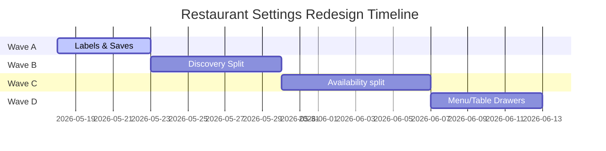

# Implementation Waves: Restaurant Settings Redesign Backlog

This document prioritizes the scored settings backlog into four logical Waves (A through D). Each wave specifies the target features, code scope, risk tier, and recommended task-folder naming conventions for the subsequent PR executions.

---

---

## Wave A: Labels, Save Scope, and Overview Alignment

_Focus: Cognitive friction quick-wins & copy harmonization._

- **Scope**:
  1. Front-end copy pass to replace technical system jargon with operator outcome labels in Profile and Availability forms.
  2. Implement local save-scope banners under all form submission groups (e.g. _"Saves Brand identity only"_).
  3. Standardize GBP connection info banners explaining that Google sync is 100% optional.
  4. Align Overview Readiness Ring targets with exact sidebar subnav status badges.
- **Risk Tier**: **Low–Medium** (frontend labels & CSS updates only; no API mutations changed).
- **Task Folder Recommendation**: `tasks/restaurant-settings-wave-a-YYYYMMDD-HHMM/`
- **Verification Plan**:
  - `pnpm run lint` & `typecheck`
  - Vitest verification on `RestaurantSetupOverview.test.tsx` and `RestaurantDetailsForm.test.tsx`

---

## Wave B: Discovery Route Promotion & Profile Split

_Focus: Splitting optional metadata out of core branding workflows._

- **Scope**:
  1. Create a standalone Next.js page route at `src/app/app/(app)/settings/restaurant/discovery/page.tsx` rendering the `discovery` view preset.
  2. Promote the extracted `DiscoveryPanelsFrame.tsx` and six panels out of the `RestaurantProfileSection` DOM tree.
  3. Wire navigation dirty intercepts into the new `/settings/restaurant/discovery` path.
  4. Implement deep hash routing so clicking comparison rows in Google Business Profile sync details correctly lands on the standalone discovery tab anchor.
- **Risk Tier**: **Medium** (routing and panel state orchestration split).
- **Task Folder Recommendation**: `tasks/restaurant-settings-wave-b-YYYYMMDD-HHMM/`
- **Verification Plan**:
  - E2E Playwright verification via `tests/e2e/ops-restaurant-settings-command-center.spec.ts`
  - Vitest test checks on `RestaurantBusinessContextSection.test.tsx`

---

## Wave C: Availability Monolith Decomposition

_Focus: Resolving the biggest code maintainability hotspots._

- **Scope**:
  1. Split `AvailabilityScheduleManager.tsx` (874 lines) and `OperatingHoursSection.tsx` (832 lines) into smaller, focused card components.
  2. Extract `WeeklyScheduleCard`, `BookingRulesCard`, and `DateOverridesCard` into dedicated files under `availability/` directory.
  3. Introduce shared form contexts or lightweight state drill-downs to ensure that tab switches do not discard unsubmitted validation properties.
  4. Add Framer Motion transitions during availability workspace swaps.
- **Risk Tier**: **Medium–High** (deep scheduling validation states & date parsing overrides).
- **Task Folder Recommendation**: `tasks/restaurant-settings-wave-c-YYYYMMDD-HHMM/`
- **Verification Plan**:
  - Vitest verification on `AvailabilitySettingsComponents.test.tsx` and `googleBusinessProfileVerification.test.ts`

---

## Wave D: Boundary Integration: Menu Quick-Edit and Table Simplification

_Focus: Cross-feature boundary workflows to accelerate manager tasks._

- **Scope**:
  1. Add a quick-edit action drawer inside `OpsMenuManagementClient` to support inline edits of pricing and stock availability (active/sold-out) without opening the full 1,000-line item sheets.
  2. Create a simplified, single-stage table setup dialog on `TableInventoryClient` allowing managers to quickly add tables (number + covers) without stepping through advanced zones, category limits, or mobility tags.
- **Risk Tier**: **Medium (cross-feature)** (requires coordinating with menu and seating capacity domain modules).
- **Task Folder Recommendation**: `tasks/restaurant-settings-wave-d-YYYYMMDD-HHMM/`
- **Verification Plan**:
  - E2E Playwright verification via `tests/e2e/ops-capacity-tables.spec.ts`
