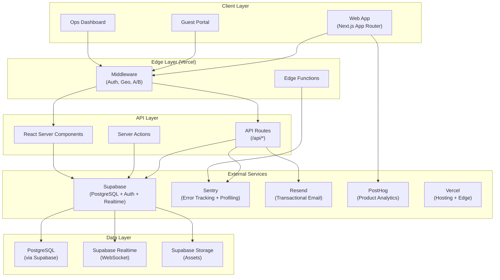
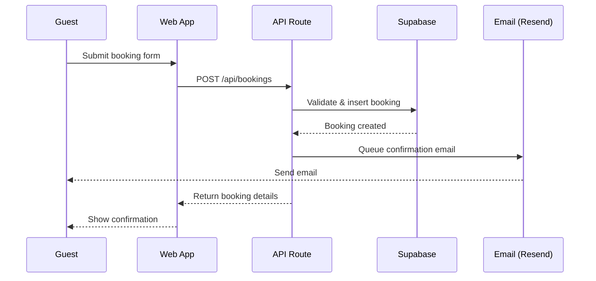
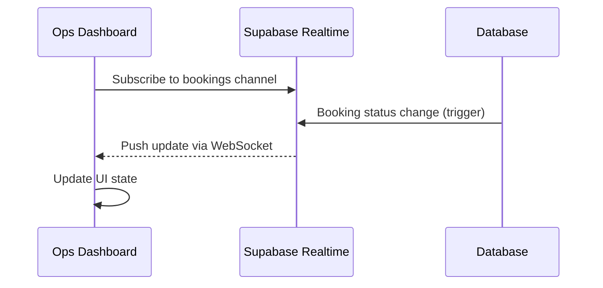
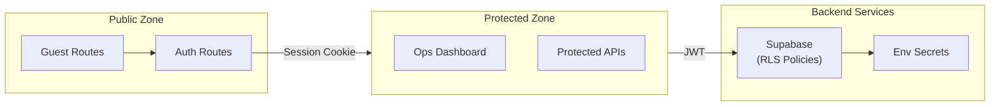
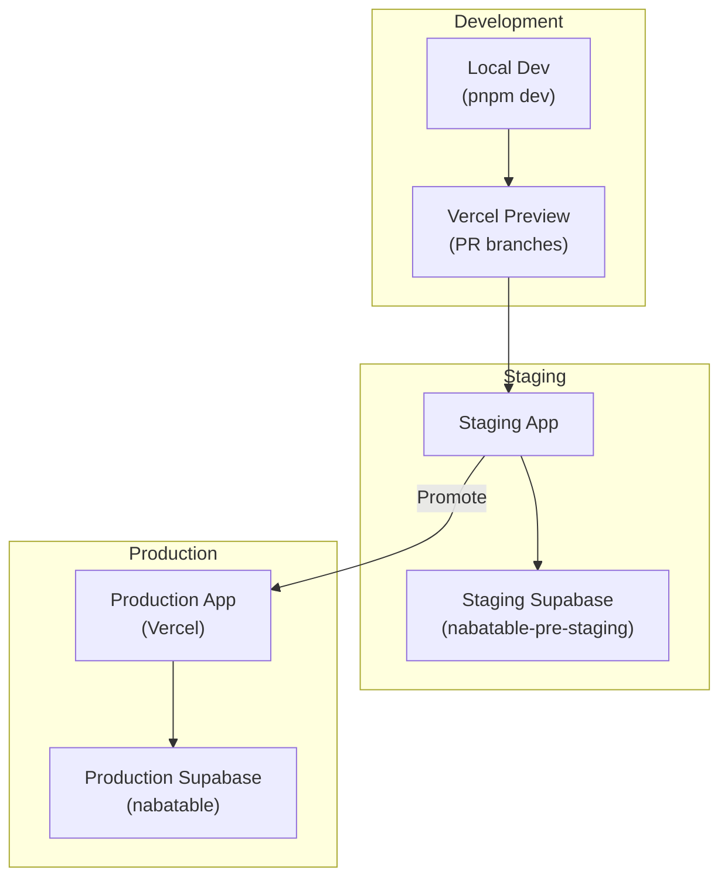

# System Architecture

Last updated: 2026-01-29

## Overview

SajiloReserveX (Nabatable) is a Next.js 14+ restaurant reservation platform with real-time capabilities.

## High-Level Architecture



## Data Flow

### Booking Flow



### Real-time Updates



## Component Architecture

### Frontend Structure

```
src/
├── app/                    # Next.js App Router
│   ├── (guest)/           # Guest-facing routes (public)
│   ├── (auth)/            # Auth routes (login, signup)
│   ├── ops/               # Ops dashboard (protected)
│   └── api/               # API routes
├── components/
│   ├── ui/                # Shadcn UI primitives
│   ├── features/          # Feature-specific components
│   └── layouts/           # Layout components
├── lib/                   # Shared utilities
├── hooks/                 # React hooks
└── styles/                # Global styles
```

### Key Modules

| Module    | Purpose                   | Key Files                      |
| --------- | ------------------------- | ------------------------------ |
| Auth      | Supabase Auth integration | `lib/auth.ts`, `middleware.ts` |
| Bookings  | Reservation management    | `features/reservations/`       |
| Real-time | WebSocket subscriptions   | `hooks/use-realtime.ts`        |
| Email     | Transactional emails      | `lib/email/`, `server/email/`  |
| Analytics | Product analytics         | `lib/posthog.ts`               |

## Security Architecture



### Security Controls

1. **Authentication**: Supabase Auth with magic link + OTP
2. **Authorization**: Row-Level Security (RLS) in PostgreSQL
3. **Session Management**: HTTP-only cookies, secure flag in production
4. **Secret Management**: Environment variables via Vercel
5. **Input Validation**: Zod schemas at API boundaries

## Observability Stack

| Layer          | Tool             | Purpose                            |
| -------------- | ---------------- | ---------------------------------- |
| Error Tracking | Sentry           | Exceptions, performance monitoring |
| Profiling      | Sentry Profiling | CPU profiling (10% sampling)       |
| Analytics      | PostHog          | Product analytics, feature flags   |
| Logging        | Vercel Logs      | Application logs                   |
| Uptime         | Vercel           | Health checks                      |

## Deployment Architecture



## External Integrations

| Service  | Purpose                   | Environment Variables                                            |
| -------- | ------------------------- | ---------------------------------------------------------------- |
| Supabase | Database, Auth, Realtime  | `SUPABASE_URL`, `SUPABASE_ANON_KEY`, `SUPABASE_SERVICE_ROLE_KEY` |
| Sentry   | Error tracking, profiling | `SENTRY_DSN`, `SENTRY_AUTH_TOKEN`                                |
| Resend   | Transactional email       | `RESEND_API_KEY`                                                 |
| PostHog  | Product analytics         | `NEXT_PUBLIC_POSTHOG_KEY`                                        |
| Vercel   | Hosting, Edge, CI/CD      | Automatic via platform                                           |

## Related Documentation

- [Routing Overview](./routing-overview.md)
- [Authentication Routes](./authentication-routes.md)
- [Database Migrations](./DATABASE_MIGRATIONS.md)
- [Rollout Strategy](./rollout-strategy.md)
- [Rollback Runbook](./runbooks/rollback.md)
