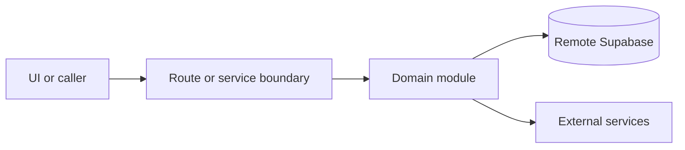

# Auth and profile

Active contributors: amanshresthaa

## Purpose

Auth and profile APIs handle Supabase sign-in, sign-up, callbacks, sign-out, profile data, profile image, invitation acceptance, throttling, and session recovery boundaries.

## Directory layout

```text
src/app/api/auth/
src/app/api/profile/
src/app/api/team/invitations/
server/auth/
server/security/
```

## Key abstractions

| Symbol or file                       | Description      |
| ------------------------------------ | ---------------- |
| `src/app/api/auth/signin/route.ts`   | Sign-in.         |
| `src/app/api/auth/signup/route.ts`   | Sign-up.         |
| `src/app/api/auth/callback/route.ts` | Callback.        |
| `server/auth/signin-throttle.ts`     | Signin throttle. |

## How it works



Route handlers collect request context and delegate business behavior to focused modules under `server/**`. Browser code should prefer existing hooks and service wrappers over ad hoc fetch logic.

## Integration points

This topic links to [Supabase and auth](../systems/supabase-auth.md), [Guest portal](../features/guest-portal.md), and [Security](../security.md).

## Entry points for modification

## Key source files

| File                               | Purpose  |
| ---------------------------------- | -------- |
| `src/app/api/auth/signin/route.ts` | Sign-in. |
| `src/app/api/auth/signup/route.ts` | Sign-up. |
| `src/app/api/profile/route.ts`     | Profile. |
