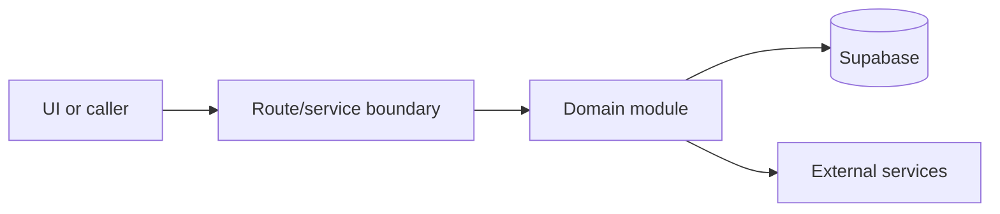

# Ops API

Active contributors: amanshresthaa, lapeninns

## Purpose

Ops APIs support protected operator workflows for bookings, dashboard, restaurants, tables, zones, team, customers, delivery, and integrations.

## Directory layout

```text
src/app/api/ops/
server/ops/
src/services/ops/
```

## Key abstractions

| Symbol or file              | Description      |
| --------------------------- | ---------------- |
| `server/auth/ops-guard.ts`  | Auth guard.      |
| `server/team/access.ts`     | Access checks.   |
| `src/services/ops/index.ts` | Client wrappers. |

## How it works



The files above form the main boundary for this topic. Route/page files collect inputs, domain modules enforce business rules, and shared helpers in `lib/**` or `server/**` keep cross-cutting behavior out of components.

## Integration points

This topic links to [Ops service layer](../systems/ops-service-layer.md), [Security](../security.md). It also uses shared configuration from `lib/env.ts` and project validation rules from `docs/sdlc/verification.md` when changes affect runtime behavior.

## Entry points for modification

Start with the first source file in the table below, then follow imports to the route, hook, or domain file closest to the behavior being changed.

## Key source files

| File                                         | Purpose     |
| -------------------------------------------- | ----------- |
| `src/app/api/ops/bookings/route.ts`          | Bookings.   |
| `src/app/api/ops/dashboard/summary/route.ts` | Dashboard.  |
| `src/app/api/ops/restaurants/[id]/route.ts`  | Restaurant. |
| `server/auth/ops-guard.ts`                   | Guard.      |

Related: [Ops service layer](../systems/ops-service-layer.md), [Security](../security.md)
