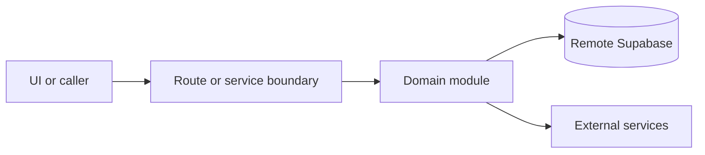

# Ops API

Active contributors: amanshresthaa

## Purpose

Ops APIs support protected operator workflows for bookings, dashboard, customers, restaurants, settings, tables, zones, team, occasions, operations hub, delivery, GBP, and dual-sync.

## Directory layout

```text
src/app/api/ops/
server/ops/
server/restaurants/
src/services/ops/
server/auth/ops-guard.ts
```

## Key abstractions

| Symbol or file              | Description                                        |
| --------------------------- | -------------------------------------------------- |
| `server/auth/ops-guard.ts`  | Auth guard.                                        |
| `server/team/access.ts`     | Restaurant access checks.                          |
| `src/services/ops/index.ts` | Client wrappers.                                   |
| `src/proxy.ts`              | Direct ops API guard and trusted header injection. |

## How it works



Route handlers collect request context and delegate business behavior to focused modules under `server/**`. Browser code should prefer existing hooks and service wrappers over ad hoc fetch logic.

## Integration points

This topic links to [Ops service layer](../systems/ops-service-layer.md), [Security](../security.md), [Restaurant settings](../features/restaurant-settings.md), and [Ops dashboard and bookings](../features/ops-dashboard-bookings.md).

## Entry points for modification

## Key source files

| File                                                        | Purpose          |
| ----------------------------------------------------------- | ---------------- |
| `src/app/api/ops/bookings/route.ts`                         | Bookings.        |
| `src/app/api/ops/dashboard/summary/route.ts`                | Dashboard.       |
| `src/app/api/ops/restaurants/[id]/dual-sync/state/route.ts` | Dual-sync state. |
