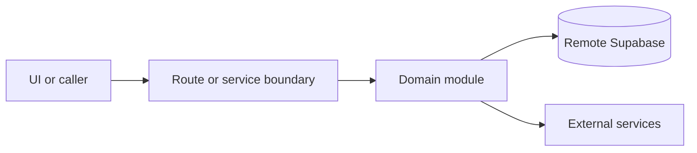

# Public API

Active contributors: amanshresthaa

## Purpose

Public APIs support restaurant discovery, availability, bookings, booking confirmation, guest booking details, manage-token flows, reservation confirmation, and profile data.

## Directory layout

```text
src/app/api/bookings/
src/app/api/restaurants/
src/app/api/availability/
src/app/api/reservations/
src/app/api/profile/
```

## Key abstractions

| Symbol or file                                     | Description                          |
| -------------------------------------------------- | ------------------------------------ |
| `src/app/api/bookings/route.ts`                    | Public booking create/list.          |
| `src/app/api/bookings/[id]/route.ts`               | Public booking detail/update/delete. |
| `src/app/api/restaurants/[slug]/schedule/route.ts` | Schedule.                            |
| `src/app/api/availability/route.ts`                | Availability.                        |

## How it works



Route handlers collect request context and delegate business behavior to focused modules under `server/**`. Browser code should prefer existing hooks and service wrappers over ad hoc fetch logic.

## Integration points

This topic links to [Public booking](../features/public-booking.md), [Guest portal](../features/guest-portal.md), and [Booking domain](../systems/booking-domain.md).

## Entry points for modification

Start with the file closest to the behavior being changed, then follow imports to the route, hook, or domain module. For route, API, auth, proxy, Supabase, shared UI, or browser changes, follow `docs/sdlc/**` before editing.

## Key source files

| File                                      | Purpose                |
| ----------------------------------------- | ---------------------- |
| `src/app/api/bookings/route.ts`           | Bookings.              |
| `src/app/api/bookings/[id]/route.ts`      | Booking detail/manage. |
| `src/app/api/restaurants/[slug]/route.ts` | Restaurant detail.     |
