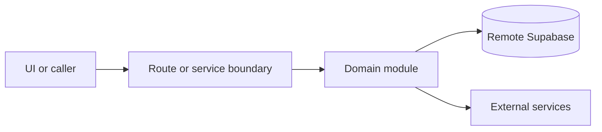

# Webhooks and cron

Active contributors: amanshresthaa

## Purpose

Webhooks and cron routes receive provider callbacks and scheduled invocations for email processing, SMS status, booking completion, dual-sync export, queue processing, health checks, refreshes, and request-log retention.

## Directory layout

```text
src/app/api/webhook/
src/app/api/cron/
vercel.json
server/jobs/
server/queue/
```

## Key abstractions

| Symbol or file                                   | Description           |
| ------------------------------------------------ | --------------------- |
| `src/app/api/webhook/resend/route.ts`            | Resend callback.      |
| `src/app/api/webhook/twilio/sms-status/route.ts` | Twilio callback.      |
| `src/app/api/cron/dual-sync/queue/route.ts`      | Dual-sync queue cron. |
| `vercel.json`                                    | Cron schedule.        |

## How it works



Route handlers collect request context and delegate business behavior to focused modules under `server/**`. Browser code should prefer existing hooks and service wrappers over ad hoc fetch logic.

## Integration points

This topic links to [Jobs and queues](../systems/jobs-queues.md), [Communications](../systems/communications.md), and [Google Business and dual sync](../systems/google-business-dual-sync.md).

## Entry points for modification

## Key source files

| File                                         | Purpose                |
| -------------------------------------------- | ---------------------- |
| `src/app/api/webhook/resend/route.ts`        | Resend.                |
| `src/app/api/cron/process-emails/route.ts`   | Email cron.            |
| `src/app/api/cron/dual-sync/health/route.ts` | Dual-sync health cron. |
