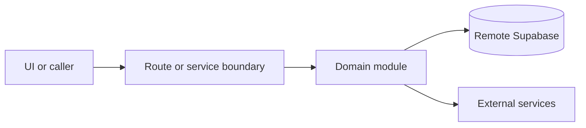

# Next.js app

Active contributors: amanshresthaa, lapeninns

## Purpose

The Next.js app hosts public, guest, ops, API, webhook, and cron routes. `src/proxy.ts` maps host context and auth expectations onto App Router files.

## Directory layout

```text
src/app/
|-- (public)/
|-- guest/
|-- app/
|-- api/
`-- providers.tsx
```

## Key abstractions

| Symbol or file                 | Description                                                                      |
| ------------------------------ | -------------------------------------------------------------------------------- |
| `src/proxy.ts`                 | Host split, redirects, app-host rewrites, trusted ops headers, and ops API auth. |
| `src/app/providers.tsx`        | Client provider stack.                                                           |
| `src/app/app/(app)/layout.tsx` | Protected ops layout.                                                            |
| `src/app/api/README.md`        | Route-handler conventions.                                                       |

## How it works



Route handlers collect request context and delegate business behavior to focused modules under `server/**`. Browser code should prefer existing hooks and service wrappers over ad hoc fetch logic.

## Integration points

This topic links to [Host routing](../systems/host-routing.md), [API](../api/index.md), [Public booking](../features/public-booking.md), and [Ops dashboard and bookings](../features/ops-dashboard-bookings.md).

## Entry points for modification

Start with the file closest to the behavior being changed, then follow imports to the route, hook, or domain module. For route, API, auth, proxy, Supabase, shared UI, or browser changes, follow `docs/sdlc/**` before editing.

## Key source files

| File                           | Purpose                    |
| ------------------------------ | -------------------------- |
| `src/proxy.ts`                 | Routing and auth boundary. |
| `src/app/layout.tsx`           | Root layout.               |
| `src/app/providers.tsx`        | Providers.                 |
| `src/app/app/(app)/layout.tsx` | Ops shell.                 |
