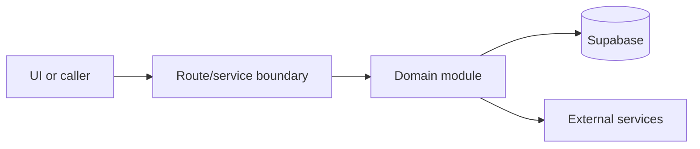

# Next.js app

Active contributors: amanshresthaa, lapeninns

## Purpose

The Next.js app hosts public, guest, ops, API, webhook, and cron routes. `src/proxy.ts` maps hosts and auth expectations onto App Router files.

## Directory layout

```text
src/app/
├── (public)/
├── guest/
├── app/
└── api/
```

## Key abstractions

| Symbol or file                 | Description                  |
| ------------------------------ | ---------------------------- |
| `src/proxy.ts`                 | Host split and API rewrites. |
| `src/app/providers.tsx`        | Client provider stack.       |
| `src/app/app/(app)/layout.tsx` | Protected ops layout.        |

## How it works



The files above form the main boundary for this topic. Route/page files collect inputs, domain modules enforce business rules, and shared helpers in `lib/**` or `server/**` keep cross-cutting behavior out of components.

## Integration points

This topic links to [Host routing](../systems/host-routing.md), [API](../api/index.md). It also uses shared configuration from `lib/env.ts` and project validation rules from `docs/sdlc/verification.md` when changes affect runtime behavior.

## Entry points for modification

Start with the first source file in the table below, then follow imports to the route, hook, or domain file closest to the behavior being changed.

## Key source files

| File                    | Purpose                    |
| ----------------------- | -------------------------- |
| `src/proxy.ts`          | Routing and auth boundary. |
| `src/app/layout.tsx`    | Root layout.               |
| `src/app/providers.tsx` | Providers.                 |
| `src/app/api/README.md` | API conventions.           |

Related: [Host routing](../systems/host-routing.md), [API](../api/index.md)
