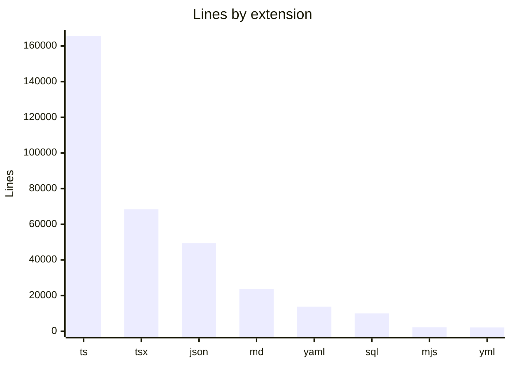

# By the numbers

Data collected on 2026-05-02 from commit `939c208ac93c3c41c66f669ba7e7705a600b828a` on branch `codex/Menu`.

| Metric                 | Value       |
| ---------------------- | ----------- |
| Source files           | 1680        |
| Test files             | 192         |
| Config/tooling files   | 128         |
| API route handlers     | 122         |
| Page components        | 47          |
| Supabase migrations    | 54          |
| Git commits            | 718         |
| Bot-attributed markers | 184 (25.6%) |

## Largest directories

| Directory                                                     | Files | Lines |
| ------------------------------------------------------------- | ----- | ----- |
| `src`                                                         | 588   | 91702 |
| `tasks`                                                       | 505   | 66852 |
| `server`                                                      | 238   | 59372 |
| `tests`                                                       | 192   | 31182 |
| `scripts`                                                     | 52    | 14991 |
| `pnpm-lock.yaml`                                              | 1     | 13179 |
| `reserve`                                                     | 109   | 11813 |
| `supabase`                                                    | 55    | 9391  |
| `components`                                                  | 55    | 8740  |
| `types`                                                       | 10    | 6771  |
| `lib`                                                         | 65    | 6097  |
| `restaurant-profile-frontend-consolidated-20260429-1803.json` | 1     | 4045  |

## Recent churn hotspots

| Path                                | Touch count signal |
| ----------------------------------- | ------------------ |
| `src/components`                    | 1096               |
| `src/app`                           | 610                |
| `tests/server`                      | 146                |
| `tests/components`                  | 141                |
| `.factory/validation`               | 128                |
| `reserve/features`                  | 105                |
| `CONTINUITY.md`                     | 88                 |
| `src/hooks`                         | 74                 |
| `supabase/migrations`               | 59                 |
| `server/google-business-profile-v2` | 58                 |
| `server/dual-sync`                  | 54                 |
| `tests/e2e`                         | 49                 |

## Largest files

| File                                                                                           | Lines |
| ---------------------------------------------------------------------------------------------- | ----- |
| `pnpm-lock.yaml`                                                                               | 13179 |
| `tasks/unused-cleanup-plan-20260501-1652/artifacts/candidate-inventory.json`                   | 10319 |
| `types/supabase.ts`                                                                            | 6325  |
| `tasks/unused-cleanup-20260501-1340/artifacts/unused-candidates.json`                          | 5326  |
| `restaurant-profile-frontend-consolidated-20260429-1803.json`                                  | 4045  |
| `server/google-business-profile/workflow.ts`                                                   | 3390  |
| `server/google-business-profile/business-info.ts`                                              | 2730  |
| `tasks/luma-compliance-checker-20260502-1344/artifacts/luma-compliance-report.json`            | 2569  |
| `tasks/luma-shared-primitives-state-20260502-1348/artifacts/luma-compliance-report-after.json` | 2484  |
| `tasks/gbp-redrift-seed-20260501-1145/artifacts/original-state.json`                           | 2343  |
| `tasks/luma-guest-navbar-20260502-1357/artifacts/luma-compliance-report-after.json`            | 2303  |
| `src/components/features/restaurant-settings/RestaurantBusinessContextSection.tsx`             | 2127  |
