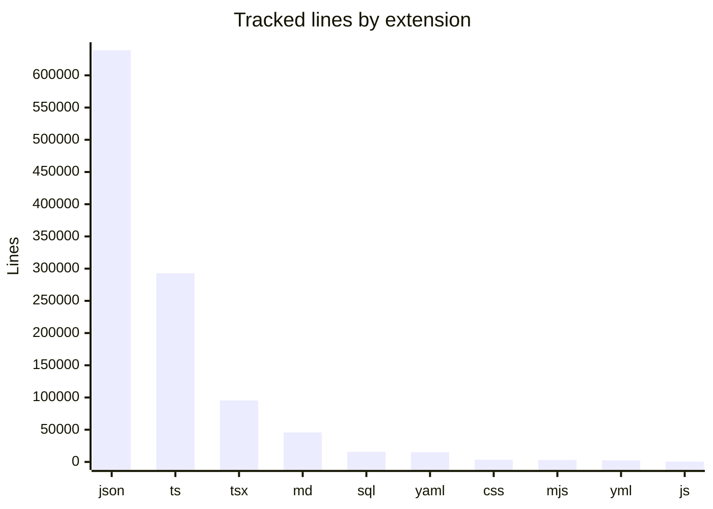

# By the numbers

Data collected on 2026-05-30T17:24:07Z from commit `dd83ed933caee0978331239201255e273c285dc2` on branch `main`.

| Metric                              | Value |
| ----------------------------------- | ----- |
| Tracked files                       | 4059  |
| Tracked JS/TS source-like files     | 2804  |
| Tracked files under `tests/**`      | 676   |
| Config/tooling files                | 260   |
| API route handlers                  | 140   |
| TS/TSX files under `src/app/api/**` | 156   |
| Page components                     | 82    |
| Supabase SQL migrations             | 91    |
| Droid wiki Markdown pages           | 66    |
| Git commits                         | 1453  |

## Largest top-level directories by tracked file count

| Directory    | Files |
| ------------ | ----- |
| `src`        | 1200  |
| `tests`      | 676   |
| `.deepsec`   | 568   |
| `server`     | 467   |
| `reserve`    | 134   |
| `tasks`      | 117   |
| `components` | 116   |
| `docs`       | 111   |
| `supabase`   | 101   |
| `scripts`    | 99    |
| `lib`        | 84    |
| `.factory`   | 77    |
| `droid-wiki` | 68    |
| `cloudflare` | 16    |
| `config`     | 13    |

## Recent commits in this snapshot

| Commit     | Date       | Message                                                                |
| ---------- | ---------- | ---------------------------------------------------------------------- |
| `dd83ed93` | 2026-05-27 | Unify restaurant settings date pickers and cron actor fallback         |
| `e8f5c704` | 2026-05-27 | Harden booking security flows and RPC privileges                       |
| `2f4fbc1b` | 2026-05-25 | Merge pull request #57 from lapeninns/Restaurant-Settings-Improvements |
| `b75a5400` | 2026-05-25 | Apply semantic color tokens and add dev pages                          |
| `0db980a6` | 2026-05-24 | Support client factory in my-bookings response                         |
| `065cc47d` | 2026-05-24 | Add bookings, dual-sync, GBP and UI features                           |
| `3542e791` | 2026-05-19 | Deduplicate restaurant settings reference data                         |

## Largest source/test hotspots

See [Complexity hotspots](cleanup-opportunities/complexity-hotspots.md) for the current largest tracked source/test files.
