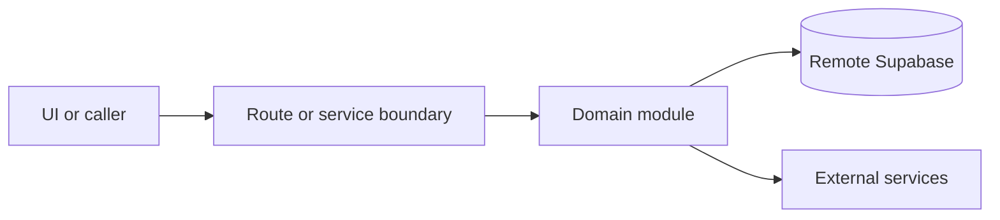

# Email and SMS delivery

Active contributors: amanshresthaa, lapeninns

## Purpose

Email and SMS delivery dashboards expose provider delivery state, retries, queue health, webhook outcomes, and booking notification attempts for operators.

## Directory layout

```text
src/app/app/(app)/email-delivery/page.tsx
src/app/app/(app)/sms-delivery/page.tsx
src/components/features/email-delivery/
server/emails/
server/sms/
```

## Key abstractions

| Symbol or file                                  | Description      |
| ----------------------------------------------- | ---------------- |
| `OpsEmailDeliveryClient`                        | Email dashboard. |
| `server/emails/email-delivery-log.ts`           | Email log.       |
| `server/sms/delivery-log.ts`                    | SMS log.         |
| `src/app/api/ops/email-delivery/retry/route.ts` | Retry API.       |

## How it works



Route handlers collect request context and delegate business behavior to focused modules under `server/**`. Browser code should prefer existing hooks and service wrappers over ad hoc fetch logic.

## Integration points

This topic links to [Communications](../systems/communications.md), [Delivery health](../how-to-monitor/delivery-health.md), and [Webhooks and cron](../api/webhooks-cron.md).

## Entry points for modification

## Key source files

| File                                      | Purpose             |
| ----------------------------------------- | ------------------- |
| `src/app/api/ops/email-delivery/route.ts` | Email delivery API. |
| `src/app/api/ops/sms-delivery/route.ts`   | SMS delivery API.   |
| `server/sms/delivery-log.ts`              | SMS log.            |
