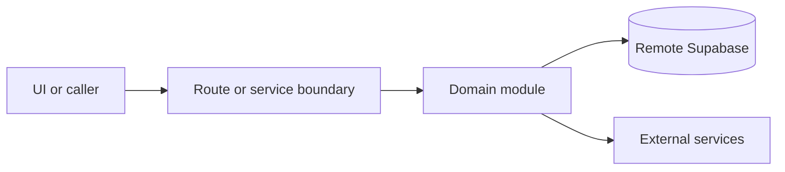

# Email and message delivery

Active contributors: amanshresthaa, lapeninns

## Purpose

Ops delivery dashboards expose provider delivery state, retries, queue health, webhook outcomes, and booking notification attempts. Email and mobile (SMS + WhatsApp) share one Communications Delivery console, while keeping separate ledgers and channel workflows.

## Product surfaces

| Surface                 | Route                                                                                          | Channels                        | Ledger                                                        |
| ----------------------- | ---------------------------------------------------------------------------------------------- | ------------------------------- | ------------------------------------------------------------- |
| Communications Overview | `/app/communications-delivery`                                                                 | Combined high-level counts only | Derived from email + message summaries                        |
| Email Delivery          | `/app/communications-delivery/email` (alias `/app/email-delivery`)                             | Resend email                    | `email_delivery_log` + feed/summary RPCs                      |
| Message Delivery        | `/app/communications-delivery/messages` (aliases `/app/sms-delivery`, `/app/message-delivery`) | Twilio SMS + WhatsApp           | `sms_delivery_log` merged with `mobile_notification_attempts` |

Booking detail uses `BookingDeliveryPanel`: Email | Messages (SMS/WhatsApp).

## Directory layout

```text
src/app/app/(app)/communications-delivery/page.tsx
src/app/app/(app)/communications-delivery/email/page.tsx
src/app/app/(app)/communications-delivery/messages/page.tsx
src/app/app/(app)/email-delivery/page.tsx
src/app/app/(app)/sms-delivery/page.tsx
src/app/app/(app)/message-delivery/page.tsx
src/components/features/communications-delivery/
src/components/features/communications-delivery-email/
src/components/features/communications-delivery-messages/
src/components/features/email-delivery/
src/components/features/sms-delivery/
server/emails/
server/sms/
server/notifications/
```

## Key abstractions

| Symbol or file                                        | Description                                       |
| ----------------------------------------------------- | ------------------------------------------------- |
| `CommunicationsDeliveryClient`                        | Unified overview shell with channel navigation.   |
| `EmailDeliveryClient` / `OpsEmailDeliveryClient`      | Lean email ops console (log / queue / analytics). |
| `MessageDeliveryClient` / `OpsSmsDeliveryClient`      | Message Delivery console (SMS + WhatsApp).        |
| `server/emails/email-delivery-log.ts`                 | Email delivery log + retry.                       |
| `server/sms/delivery-log.ts`                          | SMS + mobile ledger merge for ops feeds.          |
| `server/notifications/mobile.ts`                      | WhatsApp-first mobile dispatcher.                 |
| `src/app/api/ops/email-delivery/retry/route.ts`       | Tenant-scoped email retry (CSRF).                 |
| `src/app/api/ops/email-queue/[jobId]/cancel`          | Cancel scheduled email intent.                    |
| `src/app/api/ops/email-queue/[jobId]/requeue`         | Requeue failed email intent.                      |
| `src/app/api/ops/message-delivery/route.ts`           | Alias for the SMS/WhatsApp feed API.              |
| `src/app/api/webhook/twilio/whatsapp-status/route.ts` | WhatsApp status webhook.                          |

## How it works



Unify the ops surface. Do not merge email and mobile into one ledger or provider-agnostic send pipeline. WhatsApp belongs on Message Delivery, not Email Delivery.

## Integration points

This topic links to [Communications](../systems/communications.md), [Delivery health](../how-to-monitor/delivery-health.md), and [Webhooks and cron](../api/webhooks-cron.md).

## Key source files

| File                                                                         | Purpose                                     |
| ---------------------------------------------------------------------------- | ------------------------------------------- |
| `src/app/api/ops/email-delivery/route.ts`                                    | Email delivery feed API.                    |
| `src/app/api/ops/email-delivery/summary/route.ts`                            | Email delivery summary API.                 |
| `src/app/api/ops/sms-delivery/route.ts`                                      | Message Delivery feed API.                  |
| `src/app/api/ops/message-delivery/route.ts`                                  | Naming alias for Message Delivery feed API. |
| `server/sms/delivery-log.ts`                                                 | SMS + WhatsApp ops read model.              |
| `supabase/migrations/20260711143000_whatsapp_first_mobile_notifications.sql` | Mobile notification ledger.                 |
