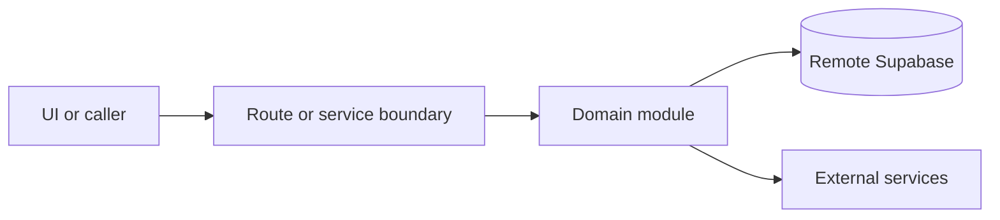

# Google Business Profile

Active contributors: amanshresthaa, lapeninns

## Purpose

Google Business Profile connects restaurants to Google, imports business data and food menus, compares canonical state, manages workflow/draft leftovers, and publishes selected sync changes through dual-sync jobs.

## Directory layout

```text
server/google-business-profile/
server/dual-sync/
src/app/api/ops/restaurants/[id]/google-business-profile/
src/app/api/ops/restaurants/[id]/google-business/
src/app/app/(app)/settings/restaurant/google-business-profile/page.tsx
```

## Key abstractions

| Symbol or file                              | Description       |
| ------------------------------------------- | ----------------- |
| `server/google-business-profile/service.ts` | Service facade.   |
| `server/google-business-profile/client.ts`  | Google client.    |
| `server/google-business-profile/crypto.ts`  | Token encryption. |
| `server/dual-sync/publish/orchestrator.ts`  | Publish jobs.     |

## How it works



Route handlers collect request context and delegate business behavior to focused modules under `server/**`. Browser code should prefer existing hooks and service wrappers over ad hoc fetch logic.

## Integration points

This topic links to [Google Business and dual sync](../systems/google-business-dual-sync.md), [Restaurant settings](restaurant-settings.md), [Security](../security.md), and [Jobs and queues](../systems/jobs-queues.md).

## Entry points for modification

Start with the file closest to the behavior being changed, then follow imports to the route, hook, or domain module. For route, API, auth, proxy, Supabase, shared UI, or browser changes, follow `docs/sdlc/**` before editing.

## Key source files

| File                                                                     | Purpose         |
| ------------------------------------------------------------------------ | --------------- |
| `server/google-business-profile/core-sync.ts`                            | Core sync.      |
| `server/google-business-profile/food-menus-sync.ts`                      | Food menu sync. |
| `src/app/app/(app)/settings/restaurant/google-business-profile/page.tsx` | Settings page.  |
