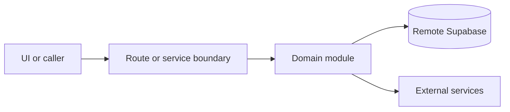

# Guest portal

Active contributors: amanshresthaa, lapeninns

## Purpose

The guest portal lets signed-in diners view dashboards, bookings, booking details, receipts, thank-you states, and profile data. Server view models prefetch guest data for hydrated clients.

## Directory layout

```text
src/app/guest/
src/guest/
src/components/features/guest/
src/app/api/profile/
server/bookings/guest-lookup-*
```

## Key abstractions

| Symbol or file                           | Description            |
| ---------------------------------------- | ---------------------- |
| `src/guest/services/server.ts`           | Server guest adapters. |
| `GuestDashboardClient`                   | Dashboard UI.          |
| `GuestProfileClient`                     | Profile UI.            |
| `server/bookings/guest-lookup-policy.ts` | Guest lookup policy.   |

## How it works



Route handlers collect request context and delegate business behavior to focused modules under `server/**`. Browser code should prefer existing hooks and service wrappers over ad hoc fetch logic.

## Integration points

This topic links to [Supabase and auth](../systems/supabase-auth.md), [Guest and customer](../primitives/guest-customer.md), and [Public booking](public-booking.md).

## Entry points for modification

Start with the file closest to the behavior being changed, then follow imports to the route, hook, or domain module. For route, API, auth, proxy, Supabase, shared UI, or browser changes, follow `docs/sdlc/**` before editing.

## Key source files

| File                                                  | Purpose         |
| ----------------------------------------------------- | --------------- |
| `src/app/guest/dashboard/page.tsx`                    | Dashboard page. |
| `src/app/guest/bookings/[bookingId]/receipt/page.tsx` | Receipt page.   |
| `src/app/api/profile/route.ts`                        | Profile API.    |
