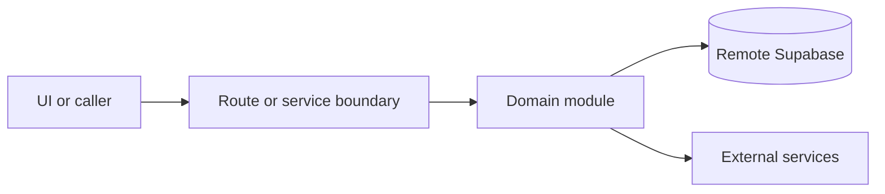

# Menu and drinks

Active contributors: amanshresthaa, lapeninns

## Purpose

Menu and drinks management imports, reviews, projects, edits, and syncs food/drink menu data across restaurant settings, Google Business Profile food menus, and local menu hierarchy UI.

## Directory layout

```text
server/menu/
server/drinks-menu/
server/google-business-profile/food-menus-*
src/components/features/menu/
src/app/api/ops/restaurants/[id]/menus/
```

## Key abstractions

| Symbol or file                        | Description                |
| ------------------------------------- | -------------------------- |
| `server/menu/import.ts`               | Menu import.               |
| `server/menu/repository.ts`           | Menu repository.           |
| `server/drinks-menu/import.ts`        | Drinks import.             |
| `food-menus-import-review-storage.ts` | GBP import-review storage. |

## How it works



Route handlers collect request context and delegate business behavior to focused modules under `server/**`. Browser code should prefer existing hooks and service wrappers over ad hoc fetch logic.

## Integration points

This topic links to [Restaurant settings](restaurant-settings.md), [Google Business Profile](google-business-profile.md), and [Google Business and dual sync](../systems/google-business-dual-sync.md).

## Entry points for modification

## Key source files

| File                                                       | Purpose             |
| ---------------------------------------------------------- | ------------------- |
| `server/menu/import.ts`                                    | Menu import.        |
| `server/google-business-profile/food-menus-sync.ts`        | GBP food menu sync. |
| `src/components/features/menu/OpsMenuManagementClient.tsx` | Menu UI.            |
