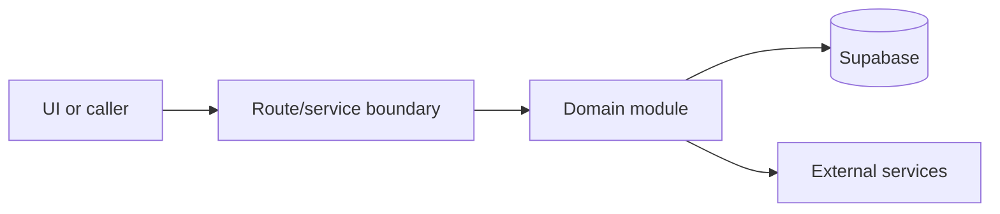

# Ops dashboard and bookings

Active contributors: amanshresthaa

## Purpose

Ops dashboard and bookings are the operator control surface for service-day reservations, statuses, table assignment, realtime updates, and customer context.

## Directory layout

```text
src/app/app/(app)/dashboard/page.tsx
src/app/app/(app)/bookings/page.tsx
src/hooks/ops/
src/app/api/ops/bookings/
```

## Key abstractions

| Symbol or file                            | Description        |
| ----------------------------------------- | ------------------ |
| `useOpsDashboardData`                     | Dashboard hook.    |
| `useOpsBookingsList`                      | Booking list hook. |
| `server/ops/booking-lifecycle/actions.ts` | Status actions.    |

## How it works



The files above form the main boundary for this topic. Route/page files collect inputs, domain modules enforce business rules, and shared helpers in `lib/**` or `server/**` keep cross-cutting behavior out of components.

## Integration points

This topic links to [Capacity and table assignment](../systems/capacity-table-assignment.md), [Ops service layer](../systems/ops-service-layer.md). It also uses shared configuration from `lib/env.ts` and project validation rules from `docs/sdlc/verification.md` when changes affect runtime behavior.

## Entry points for modification

Start with the first source file in the table below, then follow imports to the route, hook, or domain file closest to the behavior being changed.

## Key source files

| File                                                   | Purpose           |
| ------------------------------------------------------ | ----------------- |
| `src/hooks/ops/useOpsDashboardData.ts`                 | Dashboard data.   |
| `src/hooks/ops/useOpsBookingsList.ts`                  | List data.        |
| `src/app/api/ops/bookings/[id]/assign-tables/route.ts` | Assignment route. |
| `server/ops/booking-lifecycle/stateMachine.ts`         | State machine.    |

Related: [Capacity and table assignment](../systems/capacity-table-assignment.md), [Ops service layer](../systems/ops-service-layer.md)
