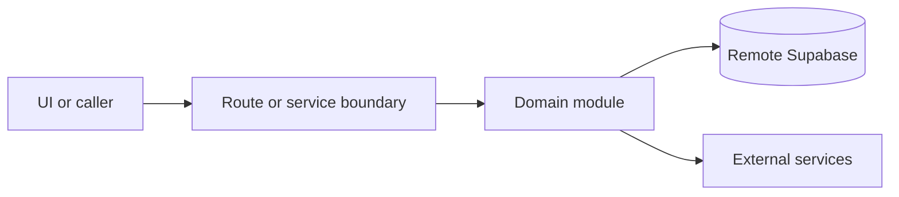

# Ops dashboard and bookings

Active contributors: amanshresthaa, lapeninns

## Purpose

Ops dashboard and bookings are the operator control surface for service-day reservations, status changes, table assignment, realtime-like refreshes, customer context, exports, delivery state, and operational summaries.

## Directory layout

```text
src/app/app/(app)/dashboard/page.tsx
src/app/app/(app)/bookings/page.tsx
src/app/app/(app)/new-bookings/page.tsx
src/hooks/ops/
src/app/api/ops/bookings/
```

## Key abstractions

| Symbol or file                            | Description              |
| ----------------------------------------- | ------------------------ |
| `useOpsDashboardData`                     | Dashboard hook.          |
| `useOpsBookingsList`                      | Booking list hook.       |
| `server/ops/booking-lifecycle/actions.ts` | Status actions.          |
| `src/services/ops/bookings.ts`            | Browser service wrapper. |

## How it works



Route handlers collect request context and delegate business behavior to focused modules under `server/**`. Browser code should prefer existing hooks and service wrappers over ad hoc fetch logic.

## Integration points

This topic links to [Capacity and table assignment](../systems/capacity-table-assignment.md), [Ops service layer](../systems/ops-service-layer.md), [Email and SMS delivery](email-sms-delivery.md), and [Ops API](../api/ops-api.md).

## Entry points for modification

Start with the file closest to the behavior being changed, then follow imports to the route, hook, or domain module. For route, API, auth, proxy, Supabase, shared UI, or browser changes, follow `docs/sdlc/**` before editing.

## Key source files

| File                                                   | Purpose           |
| ------------------------------------------------------ | ----------------- |
| `src/hooks/ops/useOpsDashboardData.ts`                 | Dashboard data.   |
| `src/app/api/ops/bookings/[id]/assign-tables/route.ts` | Assignment route. |
| `src/app/api/ops/bookings/[id]/status/route.ts`        | Status route.     |
