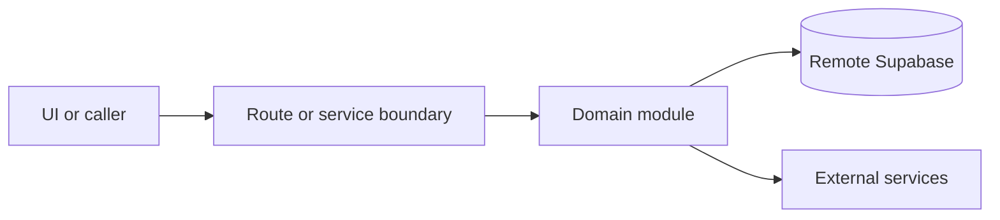

# Public booking

Active contributors: amanshresthaa, lapeninns

## Purpose

Public booking lets diners choose a restaurant, date, time, party size, contact details, and confirmation state. It spans public pages, booking wizard UI, restaurant schedule APIs, booking handlers, capacity, short links, and notifications.

## Directory layout

```text
src/app/(public)/(marketing)/restaurants/[slug]/book/page.tsx
src/app/(public)/bookings/[bookingId]/
src/components/features/booking/wizard/
src/app/api/bookings/
server/bookings/
```

## Key abstractions

| Symbol or file                       | Description                |
| ------------------------------------ | -------------------------- |
| `ReservationWizardClient`            | Public wizard client.      |
| `src/app/api/bookings/route.ts`      | Booking create/list route. |
| `src/app/api/bookings/[id]/route.ts` | Manage/detail route.       |
| `server/bookings/short-link.ts`      | Short-link integration.    |

## How it works



Route handlers collect request context and delegate business behavior to focused modules under `server/**`. Browser code should prefer existing hooks and service wrappers over ad hoc fetch logic.

## Integration points

This topic links to [Booking domain](../systems/booking-domain.md), [Reserve](../applications/reserve.md), [Public API](../api/public-api.md), and [Communications](../systems/communications.md).

## Entry points for modification

## Key source files

| File                                                                 | Purpose              |
| -------------------------------------------------------------------- | -------------------- |
| `src/components/features/booking/wizard/ReservationWizardClient.tsx` | Wizard.              |
| `src/app/api/bookings/route.ts`                                      | Create/list route.   |
| `src/app/api/bookings/[id]/route.ts`                                 | Manage/detail route. |
| `server/bookings.ts`                                                 | Booking facade.      |
