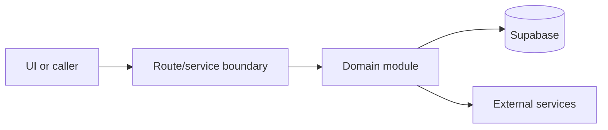

# Public booking

Active contributors: amanshresthaa

## Purpose

Public booking lets diners choose restaurant, date, party, contact details, and confirmation. It spans public pages, wizard UI, schedule APIs, booking handlers, capacity, and notifications.

## Directory layout

```text
src/app/(public)/(marketing)/restaurants/[slug]/book/page.tsx
src/components/features/booking/wizard/
src/app/api/bookings/
server/bookings.ts
```

## Key abstractions

| Symbol or file                  | Description           |
| ------------------------------- | --------------------- |
| `ReservationWizardClient`       | Public wizard client. |
| `src/app/api/bookings/route.ts` | Booking creation.     |
| `server/bookings.ts`            | Persistence.          |

## How it works



The files above form the main boundary for this topic. Route/page files collect inputs, domain modules enforce business rules, and shared helpers in `lib/**` or `server/**` keep cross-cutting behavior out of components.

## Integration points

This topic links to [Booking domain](../systems/booking-domain.md), [Reserve](../applications/reserve.md). It also uses shared configuration from `lib/env.ts` and project validation rules from `docs/sdlc/verification.md` when changes affect runtime behavior.

## Entry points for modification

Start with the first source file in the table below, then follow imports to the route, hook, or domain file closest to the behavior being changed.

## Key source files

| File                                                                 | Purpose        |
| -------------------------------------------------------------------- | -------------- |
| `src/components/features/booking/wizard/ReservationWizardClient.tsx` | Wizard.        |
| `src/app/api/bookings/route.ts`                                      | Create route.  |
| `server/restaurants/schedule.ts`                                     | Schedule.      |
| `server/bookings.ts`                                                 | Booking logic. |

Related: [Booking domain](../systems/booking-domain.md), [Reserve](../applications/reserve.md)
