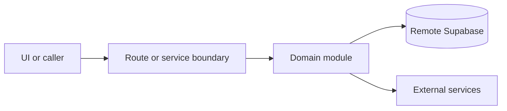

# Restaurant settings

Active contributors: amanshresthaa, lapeninns

## Purpose

Restaurant settings cover profile, discovery, availability, operating hours, service periods, occasions, turn durations, tables, team, menu, Google Business Profile, business context, and email templates.

## Directory layout

```text
src/app/app/(app)/settings/restaurant/
src/components/features/restaurant-settings/
src/components/features/menu/
server/restaurants/
src/app/api/ops/restaurants/[id]/
```

## Key abstractions

| Symbol or file                          | Description                          |
| --------------------------------------- | ------------------------------------ |
| `OpsRestaurantSettingsClient`           | Settings shell.                      |
| `RestaurantSettingsDatePickerField`     | Shared settings date picker wrapper. |
| `server/restaurants/details.ts`         | Details.                             |
| `server/restaurants/businessContext.ts` | Business context.                    |

## How it works



Route handlers collect request context and delegate business behavior to focused modules under `server/**`. Browser code should prefer existing hooks and service wrappers over ad hoc fetch logic.

## Integration points

This topic links to [Restaurant profile](../systems/restaurant-profile.md), [Menu and drinks](menu-drinks.md), [Team management](team-management.md), and [Google Business Profile](google-business-profile.md).

## Entry points for modification

Start with the file closest to the behavior being changed, then follow imports to the route, hook, or domain module. For route, API, auth, proxy, Supabase, shared UI, or browser changes, follow `docs/sdlc/**` before editing.

## Key source files

| File                                                                     | Purpose           |
| ------------------------------------------------------------------------ | ----------------- |
| `src/app/app/(app)/settings/restaurant/page.tsx`                         | Settings landing. |
| `src/app/app/(app)/settings/restaurant/google-business-profile/page.tsx` | GBP page.         |
| `server/restaurants/details.ts`                                          | Details domain.   |
