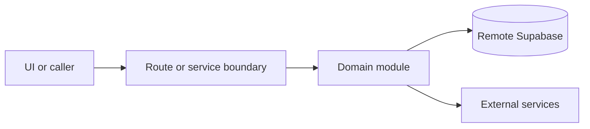

# Team management

Active contributors: amanshresthaa, lapeninns

## Purpose

Team management handles restaurant memberships, invitations, invite acceptance, role-aware access, and settings UI for operators.

## Directory layout

```text
server/team/
lib/owner/team/
src/app/api/ops/team/
src/app/api/team/invitations/
src/components/features/team/
```

## Key abstractions

| Symbol or file                   | Description          |
| -------------------------------- | -------------------- |
| `server/team/access.ts`          | Access checks.       |
| `server/team/invitations.ts`     | Invitation domain.   |
| `lib/owner/team/invite-links.ts` | Invite link helpers. |

## How it works



Route handlers collect request context and delegate business behavior to focused modules under `server/**`. Browser code should prefer existing hooks and service wrappers over ad hoc fetch logic.

## Integration points

This topic links to [Supabase and auth](../systems/supabase-auth.md), [Security](../security.md), and [Restaurant settings](restaurant-settings.md).

## Entry points for modification

## Key source files

| File                                       | Purpose                 |
| ------------------------------------------ | ----------------------- |
| `server/team/access.ts`                    | Access.                 |
| `server/team/invitations.ts`               | Invitations.            |
| `src/app/(public)/invite/[token]/page.tsx` | Invite acceptance page. |
