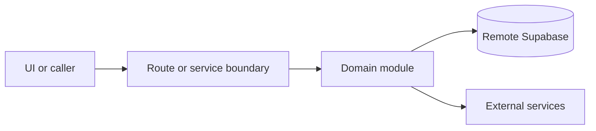

# Booking

Active contributors: amanshresthaa

## Purpose

A booking is the reservation lifecycle record used by public booking, guest account pages, ops dashboards, capacity, history, email, SMS, short links, and analytics.

## Directory layout

```text
server/bookings.ts
server/bookings/
server/booking/
server/ops/booking-lifecycle/
```

## Key abstractions

| Symbol or file            | Description                   |
| ------------------------- | ----------------------------- |
| `server/bookings.ts`      | Booking orchestration facade. |
| `server/booking/types.ts` | Shared booking types.         |
| `stateMachine.ts`         | Lifecycle state machine.      |

## How it works



Route handlers collect request context and delegate business behavior to focused modules under `server/**`. Browser code should prefer existing hooks and service wrappers over ad hoc fetch logic.

## Integration points

This primitive links to [Booking domain](../systems/booking-domain.md), [Capacity and table assignment](../systems/capacity-table-assignment.md), and [Communications](../systems/communications.md).

## Entry points for modification

## Key source files

| File                                           | Purpose              |
| ---------------------------------------------- | -------------------- |
| `server/bookings.ts`                           | Domain facade.       |
| `server/bookings/create-finalization.ts`       | Create finalization. |
| `server/ops/booking-lifecycle/stateMachine.ts` | State machine.       |
