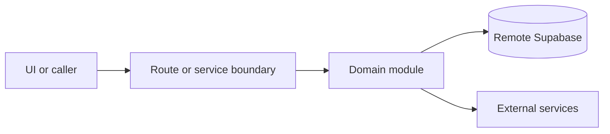

# Feature flags

Active contributors: amanshresthaa

## Purpose

Feature flags and environment controls configure allocation, lifecycle, queue, metrics, rejection analytics, realtime, manual sessions, read replicas, delivery, and integration behavior.

## Directory layout

```text
config/env.schema.ts
lib/env.ts
server/feature-flags.ts
server/feature-flags-overrides.ts
lib/feature-flags/
```

## Key abstractions

| Symbol or file            | Description                   |
| ------------------------- | ----------------------------- |
| `env.featureFlags`        | Parsed flags in `lib/env.ts`. |
| `config/env.schema.ts`    | Zod environment schema.       |
| `server/feature-flags.ts` | Server resolvers.             |

## How it works



Route handlers collect request context and delegate business behavior to focused modules under `server/**`. Browser code should prefer existing hooks and service wrappers over ad hoc fetch logic.

## Integration points

This primitive links to [Configuration](../reference/configuration.md), [Supabase remote policy](../background/supabase-remote-policy.md), and [Security](../security.md).

## Entry points for modification

Start with the file closest to the behavior being changed, then follow imports to the route, hook, or domain module. For route, API, auth, proxy, Supabase, shared UI, or browser changes, follow `docs/sdlc/**` before editing.

## Key source files

| File                             | Purpose               |
| -------------------------------- | --------------------- |
| `lib/env.ts`                     | Parsed env and flags. |
| `config/env.schema.ts`           | Schema.               |
| `scripts/feature-flags/audit.ts` | Audit.                |
