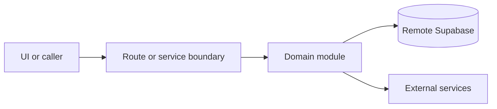

# Guest and customer

Active contributors: amanshresthaa

## Purpose

Guest and customer concepts connect Supabase auth users, booking contact data, guest lookup policy, customer history, profile data, exports, and operator customer views.

## Directory layout

```text
server/customers.ts
server/ops/customers.ts
server/bookings/guest-lookup-*
src/app/api/profile/
src/guest/
```

## Key abstractions

| Symbol or file                 | Description         |
| ------------------------------ | ------------------- |
| `server/customers.ts`          | Customer helpers.   |
| `server/ops/customers.ts`      | Ops customer views. |
| `src/app/api/profile/route.ts` | Profile API.        |

## How it works



Route handlers collect request context and delegate business behavior to focused modules under `server/**`. Browser code should prefer existing hooks and service wrappers over ad hoc fetch logic.

## Integration points

This primitive links to [Guest portal](../features/guest-portal.md), [Public booking](../features/public-booking.md), and [Ops API](../api/ops-api.md).

## Entry points for modification

## Key source files

| File                           | Purpose              |
| ------------------------------ | -------------------- |
| `server/customers.ts`          | Customer domain.     |
| `server/ops/customers.ts`      | Ops customer domain. |
| `src/app/api/profile/route.ts` | Profile route.       |
