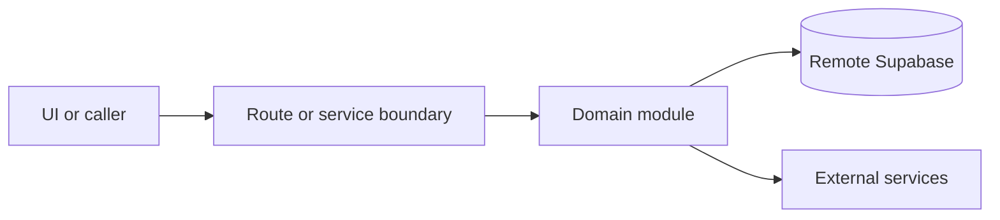

# Restaurant

Active contributors: amanshresthaa

## Purpose

A restaurant is the tenant/business record behind profile, discovery, hours, schedules, bookings, tables, teams, menus, delivery templates, and integrations.

## Directory layout

```text
server/restaurants/
src/app/api/restaurants/
src/app/api/ops/restaurants/
types/supabase.ts
```

## Key abstractions

| Symbol or file                                | Description         |
| --------------------------------------------- | ------------------- |
| `server/restaurants/details.ts`               | Details.            |
| `server/restaurants/getActiveRestaurantId.ts` | Active restaurant.  |
| `server/restaurants/getRestaurantBySlug.ts`   | Public slug lookup. |

## How it works



Route handlers collect request context and delegate business behavior to focused modules under `server/**`. Browser code should prefer existing hooks and service wrappers over ad hoc fetch logic.

## Integration points

This primitive underpins [Restaurant profile](../systems/restaurant-profile.md), [Restaurant settings](../features/restaurant-settings.md), and most ops APIs.

## Entry points for modification

Start with the file closest to the behavior being changed, then follow imports to the route, hook, or domain module. For route, API, auth, proxy, Supabase, shared UI, or browser changes, follow `docs/sdlc/**` before editing.

## Key source files

| File                            | Purpose              |
| ------------------------------- | -------------------- |
| `server/restaurants/index.ts`   | Exports.             |
| `server/restaurants/details.ts` | Details.             |
| `server/restaurants/create.ts`  | Restaurant creation. |
