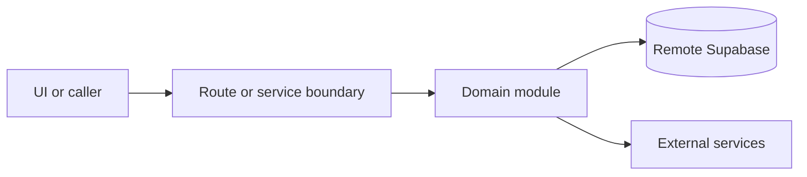

# Tables and capacity

Active contributors: amanshresthaa

## Purpose

Tables and capacity include table inventory, zones, adjacency, service policy, soft holds, planner scoring, direct assignment, manual assignment, and availability status.

## Directory layout

```text
server/capacity/
server/ops/tables.ts
server/ops/zones.ts
src/app/api/ops/tables/
src/app/api/ops/zones/
```

## Key abstractions

| Symbol or file                              | Description          |
| ------------------------------------------- | -------------------- |
| `server/capacity/types.ts`                  | Types.               |
| `server/capacity/tables.ts`                 | Table helpers.       |
| `server/capacity/adjacency.ts`              | Adjacency.           |
| `server/capacity/table-assignment/index.ts` | Assignment boundary. |

## How it works



Route handlers collect request context and delegate business behavior to focused modules under `server/**`. Browser code should prefer existing hooks and service wrappers over ad hoc fetch logic.

## Integration points

This primitive links to [Capacity and table assignment](../systems/capacity-table-assignment.md) and [Ops dashboard and bookings](../features/ops-dashboard-bookings.md).

## Entry points for modification

Start with the file closest to the behavior being changed, then follow imports to the route, hook, or domain module. For route, API, auth, proxy, Supabase, shared UI, or browser changes, follow `docs/sdlc/**` before editing.

## Key source files

| File                                        | Purpose           |
| ------------------------------------------- | ----------------- |
| `server/capacity/types.ts`                  | Types.            |
| `server/capacity/table-assignment/index.ts` | Assignments.      |
| `server/ops/tables.ts`                      | Ops table domain. |
