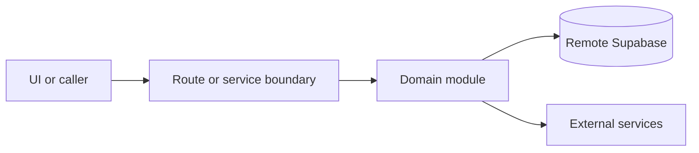

# Booking domain

Active contributors: amanshresthaa, lapeninns

## Purpose

The booking domain creates, retrieves, updates, validates, confirms, recovers, and records reservations for public, guest, and ops flows. It coordinates capacity, history, auto-assignment, short links, email, SMS, and analytics side effects.

## Directory layout

```text
server/bookings.ts
server/bookings/
server/booking/
server/ops/booking-lifecycle/
src/app/api/bookings/
```

## Key abstractions

| Symbol or file                          | Description                            |
| --------------------------------------- | -------------------------------------- |
| `BookingValidationService`              | Unified validation boundary.           |
| `server/bookings.ts`                    | Compatibility and orchestration entry. |
| `server/bookings/create-persistence.ts` | Create persistence step.               |
| `server/jobs/booking-side-effects.ts`   | Email/SMS/analytics side effects.      |

## How it works



Route handlers collect request context and delegate business behavior to focused modules under `server/**`. Browser code should prefer existing hooks and service wrappers over ad hoc fetch logic.

## Integration points

This topic links to [Public booking](../features/public-booking.md), [Guest portal](../features/guest-portal.md), [Ops dashboard and bookings](../features/ops-dashboard-bookings.md), and [Capacity and table assignment](capacity-table-assignment.md).

## Entry points for modification

Start with the file closest to the behavior being changed, then follow imports to the route, hook, or domain module. For route, API, auth, proxy, Supabase, shared UI, or browser changes, follow `docs/sdlc/**` before editing.

## Key source files

| File                                        | Purpose                                    |
| ------------------------------------------- | ------------------------------------------ |
| `server/bookings.ts`                        | Booking orchestration/facade.              |
| `server/bookings/create-request-context.ts` | Create context.                            |
| `server/bookings/my-bookings-response.ts`   | Guest booking list response.               |
| `src/app/api/bookings/[id]/route.ts`        | Public booking detail/update/delete route. |
