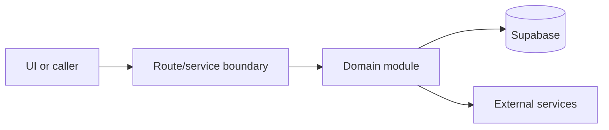

# Booking domain

Active contributors: amanshresthaa

## Purpose

The booking domain creates, updates, validates, and records reservations for public, guest, and ops flows. It also triggers history and delivery side effects.

## Directory layout

```text
server/bookings.ts
server/booking/
server/bookings/
server/ops/booking-lifecycle/
```

## Key abstractions

| Symbol or file             | Description                       |
| -------------------------- | --------------------------------- |
| `BookingValidationService` | Unified validation.               |
| `server/bookings.ts`       | Persistence flow.                 |
| `booking-side-effects`     | Email/SMS/analytics side effects. |

## How it works



The files above form the main boundary for this topic. Route/page files collect inputs, domain modules enforce business rules, and shared helpers in `lib/**` or `server/**` keep cross-cutting behavior out of components.

## Integration points

This topic links to [Public booking](../features/public-booking.md), [Ops dashboard and bookings](../features/ops-dashboard-bookings.md). It also uses shared configuration from `lib/env.ts` and project validation rules from `docs/sdlc/verification.md` when changes affect runtime behavior.

## Entry points for modification

Start with the first source file in the table below, then follow imports to the route, hook, or domain file closest to the behavior being changed.

## Key source files

| File                                         | Purpose                |
| -------------------------------------------- | ---------------------- |
| `server/bookings.ts`                         | Booking orchestration. |
| `server/booking/BookingValidationService.ts` | Validation.            |
| `server/jobs/booking-side-effects.ts`        | Side effects.          |
| `src/app/api/bookings/route.ts`              | Public route.          |

Related: [Public booking](../features/public-booking.md), [Ops dashboard and bookings](../features/ops-dashboard-bookings.md)
