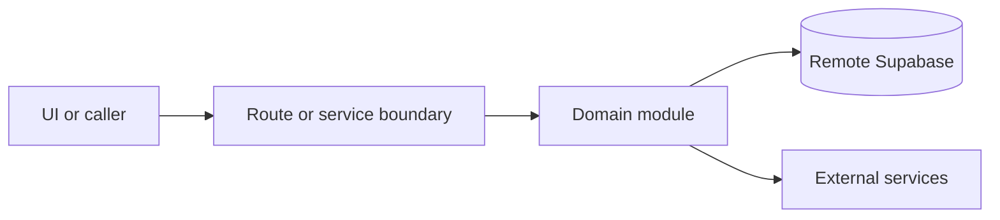

# Capacity and table assignment

Active contributors: amanshresthaa, lapeninns

## Purpose

Capacity and table assignment decide availability and seating through restaurant policy, table inventory, zones, adjacency, soft holds, direct assignment, manual assignment sessions, planner logic, and operational metrics.

## Directory layout

```text
server/capacity/
|-- engine/
|-- table-assignment/
|-- v2/
|-- planner/
`-- strategic-config.ts
```

## Key abstractions

| Symbol or file                                   | Description                      |
| ------------------------------------------------ | -------------------------------- |
| `server/capacity/index.ts`                       | Public module boundary.          |
| `server/capacity/engine/public-api.ts`           | Availability engine boundary.    |
| `server/capacity/table-assignment/soft-holds.ts` | Hold acquire/release.            |
| `server/capacity/table-assignment/manual.ts`     | Manual assignment orchestration. |

## How it works



Route handlers collect request context and delegate business behavior to focused modules under `server/**`. Browser code should prefer existing hooks and service wrappers over ad hoc fetch logic.

## Integration points

This topic links to [Tables and capacity](../primitives/table-capacity.md), [Booking domain](booking-domain.md), and ops table/booking routes. Recent migrations harden soft-hold authorization, table inventory deletion, unassignment, and hold expiry behavior.

## Entry points for modification

## Key source files

| File                                                                        | Purpose                  |
| --------------------------------------------------------------------------- | ------------------------ |
| `server/capacity/index.ts`                                                  | Exports.                 |
| `server/capacity/table-assignment/assignment.ts`                            | Assignment logic.        |
| `server/capacity/table-assignment/manual-soft-holds.ts`                     | Manual soft-hold helper. |
| `supabase/migrations/20260516070700_harden_soft_hold_rpc_authorization.sql` | Soft-hold RPC hardening. |
