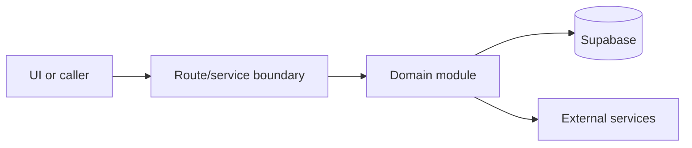

# Capacity and table assignment

Active contributors: amanshresthaa

## Purpose

Capacity and table assignment decide availability and seating through table inventory, policy, planners, soft holds, and assignment routes.

## Directory layout

```text
server/capacity/
├── engine/
├── table-assignment/
├── v2/
└── planner/
```

## Key abstractions

| Symbol or file             | Description             |
| -------------------------- | ----------------------- |
| `server/capacity/index.ts` | Public module boundary. |
| `soft-holds.ts`            | Hold acquire/release.   |
| `v2/orchestrator.ts`       | Planner orchestration.  |

## How it works



The files above form the main boundary for this topic. Route/page files collect inputs, domain modules enforce business rules, and shared helpers in `lib/**` or `server/**` keep cross-cutting behavior out of components.

## Integration points

This topic links to [Tables and capacity](../primitives/table-capacity.md), [Booking domain](booking-domain.md). It also uses shared configuration from `lib/env.ts` and project validation rules from `docs/sdlc/verification.md` when changes affect runtime behavior.

## Entry points for modification

Start with the first source file in the table below, then follow imports to the route, hook, or domain file closest to the behavior being changed.

## Key source files

| File                                                                      | Purpose              |
| ------------------------------------------------------------------------- | -------------------- |
| `server/capacity/index.ts`                                                | Exports.             |
| `server/capacity/table-assignment/soft-holds.ts`                          | Soft holds.          |
| `server/capacity/engine/public-api.ts`                                    | Availability engine. |
| `supabase/migrations/20260208013100_create_acquire_soft_holds_atomic.sql` | Atomic hold RPC.     |

Related: [Tables and capacity](../primitives/table-capacity.md), [Booking domain](booking-domain.md)
