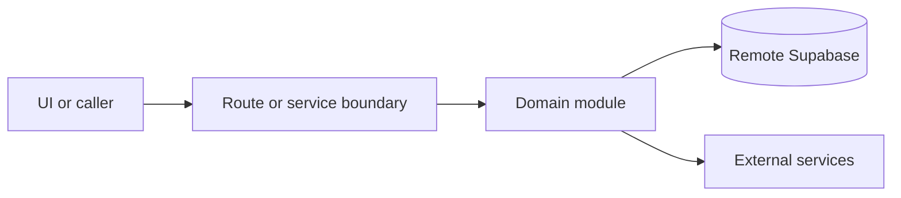

# Communications

Active contributors: amanshresthaa, lapeninns

## Purpose

Communications covers booking emails, SMS, WhatsApp-first mobile notifications, durable email intents, delivery logs, provider webhooks, retries, queue processing, operator dashboards, and Cloudflare delivery gateways.

## Directory layout

```text
server/emails/
server/sms/
server/notifications/
server/queue/
src/app/api/webhook/
cloudflare/email-queue-gateway/
cloudflare/sms-summary-gateway/
```

## Key abstractions

| Symbol or file                       | Description                                       |
| ------------------------------------ | ------------------------------------------------- |
| `server/emails/bookings.ts`          | Booking email behavior.                           |
| `server/queue/email-intents.ts`      | Durable email intents (cancel / requeue for ops). |
| `server/queue/email-processing.ts`   | Email queue processing.                           |
| `server/sms/bookings.ts`             | Booking SMS / mobile send entry.                  |
| `server/notifications/mobile.ts`     | WhatsApp-first mobile dispatcher + SMS fallback.  |
| `server/booking/whatsapp-consent.ts` | Guest WhatsApp consent gating.                    |

## Channel model

- **Ops console** — Unified Communications Delivery at `/app/communications-delivery`, with Email and Messages channel views.
- **Email** — Resend + `email_delivery_log`; ops at `/app/communications-delivery/email` (alias `/app/email-delivery`).
- **SMS + WhatsApp** — Twilio; unified mobile ledger (`mobile_notifications` / `mobile_notification_attempts`) merged with legacy `sms_delivery_log` for Message Delivery at `/app/communications-delivery/messages` (aliases `/app/sms-delivery`, `/app/message-delivery`).
- Do not put WhatsApp onto the email delivery page or share one cross-channel log table.

## How it works



Route handlers collect request context and delegate business behavior to focused modules under `server/**`. Browser code should prefer existing hooks and service wrappers over ad hoc fetch logic.

## Integration points

This topic links to [Email and message delivery](../features/email-sms-delivery.md), [Delivery health](../how-to-monitor/delivery-health.md), [Webhooks and cron](../api/webhooks-cron.md), and [Cloudflare Workers](../applications/cloudflare-workers.md).

## Key source files

| File                                                            | Purpose                                 |
| --------------------------------------------------------------- | --------------------------------------- |
| `server/emails/bookings.ts`                                     | Emails.                                 |
| `server/emails/email-delivery-log.ts`                           | Email delivery log + retry.             |
| `server/queue/email-processing.ts`                              | Queue processing.                       |
| `server/sms/delivery-log.ts`                                    | SMS + WhatsApp ops read model.          |
| `server/notifications/whatsapp-status.ts`                       | WhatsApp status callback handling.      |
| `cloudflare/email-queue-gateway/src/index.mjs`                  | Email gateway worker.                   |
| `cloudflare/sms-summary-gateway/src/manager-whatsapp-status.ts` | Manager WhatsApp status reconciliation. |
