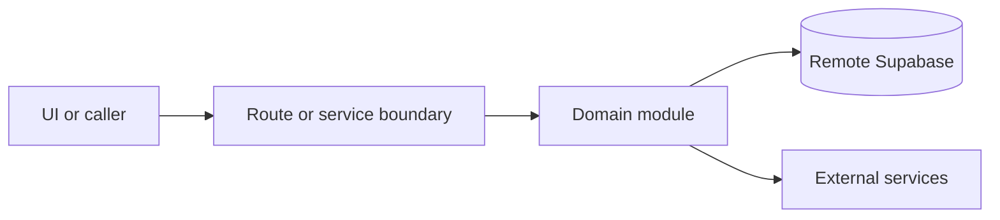

# Communications

Active contributors: amanshresthaa, lapeninns

## Purpose

Communications covers booking emails, SMS, durable email intents, delivery logs, provider webhooks, retries, queue processing, operator dashboards, and Cloudflare delivery gateways.

## Directory layout

```text
server/emails/
server/sms/
server/queue/
src/app/api/webhook/
cloudflare/email-queue-gateway/
cloudflare/sms-summary-gateway/
```

## Key abstractions

| Symbol or file                     | Description             |
| ---------------------------------- | ----------------------- |
| `server/emails/bookings.ts`        | Booking email behavior. |
| `server/queue/email-intents.ts`    | Durable email intents.  |
| `server/queue/email-processing.ts` | Email queue processing. |
| `server/sms/bookings.ts`           | Booking SMS behavior.   |

## How it works



Route handlers collect request context and delegate business behavior to focused modules under `server/**`. Browser code should prefer existing hooks and service wrappers over ad hoc fetch logic.

## Integration points

This topic links to [Email and SMS delivery](../features/email-sms-delivery.md), [Delivery health](../how-to-monitor/delivery-health.md), [Webhooks and cron](../api/webhooks-cron.md), and [Cloudflare Workers](../applications/cloudflare-workers.md).

## Entry points for modification

## Key source files

| File                                           | Purpose               |
| ---------------------------------------------- | --------------------- |
| `server/emails/bookings.ts`                    | Emails.               |
| `server/queue/email-processing.ts`             | Queue processing.     |
| `server/sms/delivery-log.ts`                   | SMS log.              |
| `cloudflare/email-queue-gateway/src/index.mjs` | Email gateway worker. |
