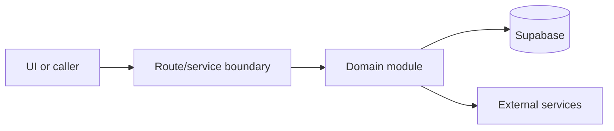

# Communications

Active contributors: amanshresthaa

## Purpose

Communications covers booking emails, SMS, durable email intents, delivery logs, provider webhooks, retries, and operator delivery dashboards.

## Directory layout

```text
server/emails/
server/sms/
server/queue/
src/app/api/webhook/
```

## Key abstractions

| Symbol or file                  | Description             |
| ------------------------------- | ----------------------- |
| `server/emails/bookings.ts`     | Booking email behavior. |
| `server/queue/email-intents.ts` | Durable email intents.  |
| `server/sms/bookings.ts`        | Booking SMS behavior.   |

## How it works



The files above form the main boundary for this topic. Route/page files collect inputs, domain modules enforce business rules, and shared helpers in `lib/**` or `server/**` keep cross-cutting behavior out of components.

## Integration points

This topic links to [Email and SMS delivery](../features/email-sms-delivery.md), [Delivery health](../how-to-monitor/delivery-health.md). It also uses shared configuration from `lib/env.ts` and project validation rules from `docs/sdlc/verification.md` when changes affect runtime behavior.

## Entry points for modification

Start with the first source file in the table below, then follow imports to the route, hook, or domain file closest to the behavior being changed.

## Key source files

| File                                  | Purpose           |
| ------------------------------------- | ----------------- |
| `server/emails/bookings.ts`           | Emails.           |
| `server/queue/email-processing.ts`    | Queue processing. |
| `server/sms/delivery-log.ts`          | SMS log.          |
| `src/app/api/webhook/resend/route.ts` | Resend webhook.   |

Related: [Email and SMS delivery](../features/email-sms-delivery.md), [Delivery health](../how-to-monitor/delivery-health.md)
