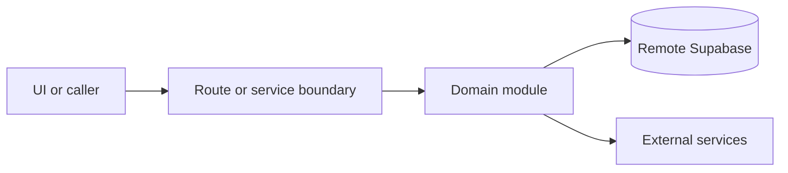

# Google Business and dual sync

Active contributors: amanshresthaa, lapeninns

## Purpose

Google Business and dual sync manage OAuth, Google profile reads, canonical profile state, food menus, import review, outbound candidates, snapshots, publish jobs, queue workers, refreshes, request logs, and operational alerts.

## Directory layout

```text
server/google-business-profile/
server/dual-sync/
src/app/api/ops/restaurants/[id]/google-business-profile/
src/app/api/ops/restaurants/[id]/dual-sync/
```

## Key abstractions

| Symbol or file                                      | Description            |
| --------------------------------------------------- | ---------------------- |
| `server/google-business-profile/service.ts`         | GBP service boundary.  |
| `server/google-business-profile/core-sync.ts`       | Core sync entry.       |
| `server/google-business-profile/food-menus-sync.ts` | Food menu sync.        |
| `server/dual-sync/publish/orchestrator.ts`          | Publish orchestration. |

## How it works



Route handlers collect request context and delegate business behavior to focused modules under `server/**`. Browser code should prefer existing hooks and service wrappers over ad hoc fetch logic.

## Integration points

This topic links to [Google Business Profile](../features/google-business-profile.md), [Restaurant settings](../features/restaurant-settings.md), [Jobs and queues](jobs-queues.md), and [Security](../security.md).

## Entry points for modification

Start with the file closest to the behavior being changed, then follow imports to the route, hook, or domain module. For route, API, auth, proxy, Supabase, shared UI, or browser changes, follow `docs/sdlc/**` before editing.

## Key source files

| File                                                                 | Purpose                    |
| -------------------------------------------------------------------- | -------------------------- |
| `server/google-business-profile/service.ts`                          | Service boundary.          |
| `server/google-business-profile/crypto.ts`                           | Token encryption.          |
| `server/google-business-profile/food-menus-import-review-storage.ts` | Import-review persistence. |
| `server/dual-sync/scheduling/auto-export.ts`                         | Scheduled export.          |
