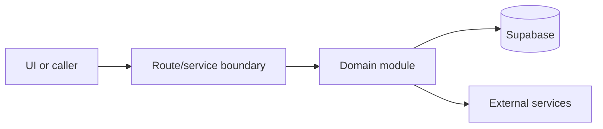

# Google Business and dual sync

Active contributors: amanshresthaa

## Purpose

Google Business and dual sync manage OAuth, Google profile reads, canonical profile state, drafts, import/export ports, publish jobs, and sync state.

## Directory layout

```text
server/google-business-profile/
server/dual-sync/
src/app/api/ops/restaurants/[id]/google-business-profile/
```

## Key abstractions

| Symbol or file            | Description            |
| ------------------------- | ---------------------- |
| `client.ts`               | Google API adapter.    |
| `workflow.ts`             | GBP workflow.          |
| `state/compute.ts`        | Sync diff computation. |
| `publish/orchestrator.ts` | Publish orchestration. |

## How it works



The files above form the main boundary for this topic. Route/page files collect inputs, domain modules enforce business rules, and shared helpers in `lib/**` or `server/**` keep cross-cutting behavior out of components.

## Integration points

This topic links to [Google Business Profile](../features/google-business-profile.md). It also uses shared configuration from `lib/env.ts` and project validation rules from `docs/sdlc/verification.md` when changes affect runtime behavior.

## Entry points for modification

Start with the first source file in the table below, then follow imports to the route, hook, or domain file closest to the behavior being changed.

## Key source files

| File                                        | Purpose                |
| ------------------------------------------- | ---------------------- |
| `server/google-business-profile/service.ts` | Service boundary.      |
| `server/google-business-profile/crypto.ts`  | Token encryption.      |
| `server/dual-sync/state/compute.ts`         | State computation.     |
| `server/dual-sync/publish/orchestrator.ts`  | Publish orchestration. |

Related: [Google Business Profile](../features/google-business-profile.md)
