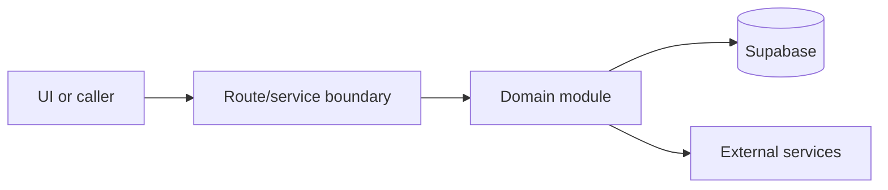

# Host routing

Active contributors: amanshresthaa

## Purpose

Host routing separates app-host operator traffic from root-host guest traffic, redirects wrong-surface paths, rewrites protected ops pages, and guards `/api/ops/**`.

## Directory layout

```text
src/proxy.ts
next.config.js
server/auth/ops-guard.ts
```

## Key abstractions

| Symbol or file     | Description                     |
| ------------------ | ------------------------------- |
| `handleRouting`    | Main proxy decision function.   |
| `OPS_API_SERVICES` | App-host API rewrite allowlist. |
| `requireOpsAuth`   | Ops API guard.                  |

## How it works



The files above form the main boundary for this topic. Route/page files collect inputs, domain modules enforce business rules, and shared helpers in `lib/**` or `server/**` keep cross-cutting behavior out of components.

## Integration points

This topic links to [Security](../security.md), [API](../api/index.md). It also uses shared configuration from `lib/env.ts` and project validation rules from `docs/sdlc/verification.md` when changes affect runtime behavior.

## Entry points for modification

Start with the first source file in the table below, then follow imports to the route, hook, or domain file closest to the behavior being changed.

## Key source files

| File                       | Purpose        |
| -------------------------- | -------------- |
| `src/proxy.ts`             | Routing logic. |
| `server/auth/ops-guard.ts` | Ops guard.     |
| `next.config.js`           | Redirects.     |

Related: [Security](../security.md), [API](../api/index.md)
