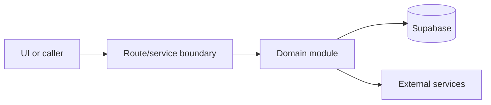

# Supabase and auth

Active contributors: amanshresthaa

## Purpose

Supabase is the remote database/auth/storage layer. Central client factories, auth guards, and team access helpers keep sessions and tenant checks consistent.

## Directory layout

```text
server/supabase.ts
server/auth/
server/team/
lib/supabase/
```

## Key abstractions

| Symbol or file                  | Description                   |
| ------------------------------- | ----------------------------- |
| `getRouteHandlerSupabaseClient` | Route-handler client.         |
| `getServiceRoleSupabaseClient`  | Service-role client.          |
| `server/team/access.ts`         | Restaurant permission checks. |

## How it works



The files above form the main boundary for this topic. Route/page files collect inputs, domain modules enforce business rules, and shared helpers in `lib/**` or `server/**` keep cross-cutting behavior out of components.

## Integration points

This topic links to [Security](../security.md), [Configuration](../reference/configuration.md). It also uses shared configuration from `lib/env.ts` and project validation rules from `docs/sdlc/verification.md` when changes affect runtime behavior.

## Entry points for modification

Start with the first source file in the table below, then follow imports to the route, hook, or domain file closest to the behavior being changed.

## Key source files

| File                       | Purpose           |
| -------------------------- | ----------------- |
| `server/supabase.ts`       | Client factories. |
| `server/auth/guards.ts`    | Auth guards.      |
| `server/auth/ops-guard.ts` | Ops auth.         |
| `server/team/access.ts`    | Tenant access.    |

Related: [Security](../security.md), [Configuration](../reference/configuration.md)
