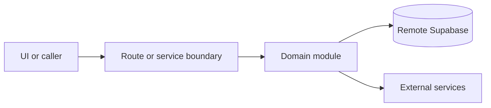

# Supabase and auth

Active contributors: amanshresthaa, lapeninns

## Purpose

Supabase is the remote database, auth, and storage layer. Client factories, auth guards, tenant access helpers, CSRF checks, service-role guards, and env validation keep sessions and tenant boundaries explicit.

## Directory layout

```text
server/supabase.ts
server/auth/
server/team/
lib/supabase/
lib/security/
config/env.schema.ts
```

## Key abstractions

| Symbol or file                  | Description                   |
| ------------------------------- | ----------------------------- |
| `getRouteHandlerSupabaseClient` | Route-handler client.         |
| `getServiceRoleSupabaseClient`  | Service-role client.          |
| `server/team/access.ts`         | Restaurant permission checks. |
| `lib/security/csrf.ts`          | CSRF helpers.                 |

## How it works



Route handlers collect request context and delegate business behavior to focused modules under `server/**`. Browser code should prefer existing hooks and service wrappers over ad hoc fetch logic.

## Integration points

This topic links to [Security](../security.md), [Configuration](../reference/configuration.md), and [Supabase remote policy](../background/supabase-remote-policy.md). Recent hardening includes `20260527111100_harden_service_only_rpc_privileges.sql`.

## Entry points for modification

Start with the file closest to the behavior being changed, then follow imports to the route, hook, or domain module. For route, API, auth, proxy, Supabase, shared UI, or browser changes, follow `docs/sdlc/**` before editing.

## Key source files

| File                                                                        | Purpose                     |
| --------------------------------------------------------------------------- | --------------------------- |
| `server/supabase.ts`                                                        | Client factories.           |
| `server/auth/guards.ts`                                                     | Auth guards.                |
| `server/auth/ops-guard.ts`                                                  | Ops auth.                   |
| `supabase/migrations/20260527111100_harden_service_only_rpc_privileges.sql` | Service-only RPC hardening. |
